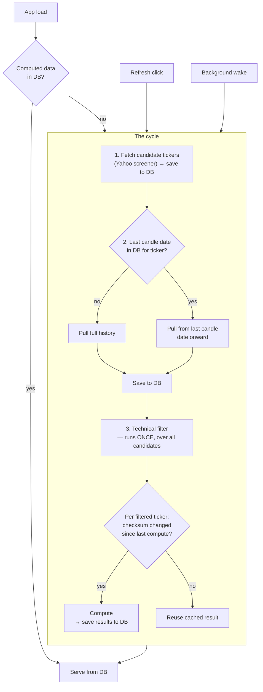

# Screening/Fetch Unification

Status: design, not implemented.

## The cycle

1. Fetch candidate tickers (Yahoo screener) → save to DB.
2. Pull each ticker's price data → save to DB.
   Before pulling, check the DB for that ticker's last candle date.
   No existing data → pull full history. Data exists → pull only from the
   last candle date onward (incremental).
3. Technical filter runs once, over all candidates. For each ticker that
   passes: compute only if its data changed (checksum) since last compute
   → save results to DB.

One cycle, one download per ticker, everything persisted as it goes.

## When it runs

- **App load / refresh (browser):** if computed data already exists in the
  DB, just serve it — no fetch, no compute.
- **No computed data exists:** run the cycle.
- **User clicks Refresh:** run the cycle.
- **Background loop (every `CHECK_INTERVAL`):** run the cycle.

## What goes away

- `backend/tickers.py` (the file). Candidates live in a DB table instead.
- The separate screening download (`screen_technicals()`'s own
  `yf.download(chunk, period="2y")`). Screening becomes: get candidate
  symbols, then reuse the normal per-ticker fetch for their bars.

## Cold start

Empty DB (fresh deploy, wiped DB) — nothing exists yet for the app to
serve, so the first load waits until the cycle finishes.

## Resolved

- **No double screener call.** `_active_tickers()` only reads the candidate
  table (+ watchlist) from the DB. It never calls the Yahoo screener
  itself — step 1 of the cycle is the only place that happens, once, before
  `_active_tickers()` is read.
- **Filter runs once, up front — not per ticker on reuse.** `compute_all()`
  runs the technical filter a single time over all candidates, first thing.
  Only tickers that pass move on to the per-ticker checksum check; only
  those whose checksum changed get recomputed, the rest reuse their cached
  result. The filter itself isn't re-run per ticker as part of the reuse
  decision.
- **Checksum, not last-bar-only fingerprint.** "Unchanged" is decided by
  hashing all of a ticker's stored bars (date + OHLCV), not just the most
  recent one. The current code only fingerprints the last bar's date+close,
  which misses a revision to an earlier bar in the history — a full
  checksum catches that too, for a small, still-cheap (no network) cost.
