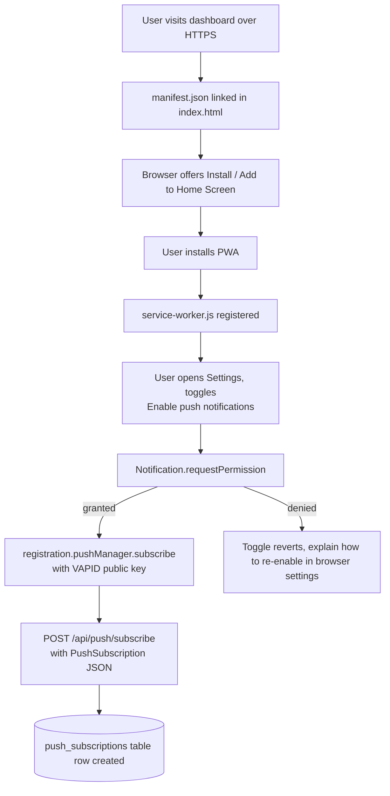
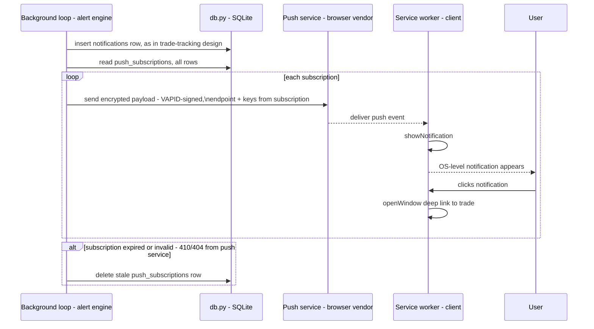

# PWA & Push Notifications — Design

Date: 2026-07-31
Status: Design, not implemented
Depends on: [Trade Tracking & TP/Stop Notifications](2026-07-31-trade-tracking-design.md) —
this design assumes the `notifications` table and alert engine described there already exist;
it only adds the delivery mechanism (installable app + push) on top.

## Background

The trade-tracking design produces `notifications` rows (TP/stop threshold crossings) but only
surfaces them in-app, requiring the dashboard to be open and polled. This design makes the app
installable as a Progressive Web App and adds push delivery so alerts reach the user's device
even when the dashboard tab isn't open — the actual motivating use case ("I get pinged when a
trade is nearing TP/stop without having to babysit a browser tab").

This is deliberately a separate, later phase: it depends on the notification-producing side
existing first, and it introduces its own new surface area (service worker lifecycle, HTTPS/
manifest requirements, browser permission prompts, subscription persistence) that shouldn't be
bundled into the trade-tracking rollout.

## Scope

1. Make the existing single-page app installable (manifest + icons + service worker), so it
   behaves like a native app on desktop/mobile home screens.
2. Add Web Push: server-side subscription storage, a VAPID key pair, and a push send path
   triggered from the same alert engine that already writes `notifications` rows.
3. Service worker shows the push as an OS-level notification even when the app isn't open;
   clicking it opens/focuses the app to the relevant trade.

Not in scope: offline data access (the app is read/write against a live backend; there's no
meaningful "offline mode" for trade data), background sync, or any native-app-store packaging.

## Prerequisites / constraints

- **HTTPS is mandatory** for both service workers and Push API — this app currently runs
  locally / presumably behind whatever the user's deployment is. Whatever hosts this in
  production must terminate TLS before push can work at all; this design doesn't cover that
  deployment step, only flags it as a hard requirement.
- Push requires explicit, user-initiated permission (`Notification.requestPermission()`) —
  can't be requested on page load; must be behind a deliberate user action (e.g. a toggle in
  settings, "Enable push notifications").
- iOS Safari supports Web Push only when the PWA has been "installed" (added to home screen)
  as of recent iOS versions — desktop Chrome/Edge/Firefox support it directly in-browser. The
  UI should treat "installed" as the expected path, not assume browser-tab push works
  everywhere.

## Flow: install + subscribe



## Flow: alert delivery via push



## Data model

New table `push_subscriptions` (via `webapp/db.py`, same connection/lock pattern):

```
id           INTEGER PRIMARY KEY
endpoint     TEXT UNIQUE   -- push service URL, uniquely identifies a subscription
p256dh       TEXT          -- subscription encryption key
auth         TEXT          -- subscription auth secret
created_at   TEXT
last_seen_at TEXT          -- updated whenever a push send succeeds, for pruning stale rows
```

No user/account table exists in this app (single-user tool), so subscriptions aren't scoped to
a user id — every stored subscription receives every push. If the app ever gains multi-device
use by one person (phone + desktop both installed), that's still correct behavior: both should
be notified.

VAPID key pair generated once, stored as environment variables (`VAPID_PUBLIC_KEY`,
`VAPID_PRIVATE_KEY`, `VAPID_SUBJECT` — a mailto: or URL identifying the app, per Web Push spec),
loaded the same way other env-var config already works in this project (`.env` at project root,
per `build_universe.py`'s existing pattern). Never committed to the repo.

## API surface

New routes in `webapp/app.py`:

- `GET /api/push/vapid-public-key` — returns the public key so the client can subscribe.
- `POST /api/push/subscribe` — body is the browser's `PushSubscription.toJSON()`; upsert into
  `push_subscriptions` keyed on `endpoint`.
- `POST /api/push/unsubscribe` — remove a subscription (endpoint in body), called when the
  user toggles push off.

## New static assets

- `webapp/static/manifest.json` — name, icons (multiple sizes), `start_url`, `display:
  "standalone"`, theme/background colors matching the existing dashboard palette.
- `webapp/static/service-worker.js` — installs/activates, handles `push` events (parse payload,
  `showNotification`), handles `notificationclick` (focus or open the app, navigate to the
  trade if a deep-link scheme is added to the SPA router).
- App icons at the sizes the manifest references (need to be produced — no existing icon set
  in the repo to reuse, per current file listing).
- `index.html` gets a `<link rel="manifest">` tag and a small bit of JS to register the service
  worker and drive the subscribe/unsubscribe toggle.

## Server-side send path

Reuses Python's `pywebpush` (new dependency — nothing in `requirements.txt` currently handles
Web Push signing/encryption) to send the VAPID-signed payload to each stored subscription's
endpoint. Triggered from the same point in the background loop where the trade-tracking design
inserts a `notifications` row — after computing `pct_to_tp`/`pct_to_stop` and detecting a newly
crossed threshold, send the same message as a push payload in addition to the DB insert.

Payload keeps to what's needed client-side to render + deep-link:
```json
{ "title": "AAPL nearing TP", "body": "70% of the way to your $180 target", "trade_id": 42 }
```

## Explicitly out of scope

- Any native app store packaging (this is web-installable only, not a wrapped native build).
- Multi-user auth / per-user subscription scoping (no accounts exist in this app).
- Offline data caching strategies (no meaningful offline mode for live trade data).
- Rich notification actions (e.g. "Close trade" button directly in the OS notification) — a
  possible future enhancement once basic push delivery is proven out.
- Deployment/HTTPS setup itself — flagged as a hard prerequisite, not designed here.
