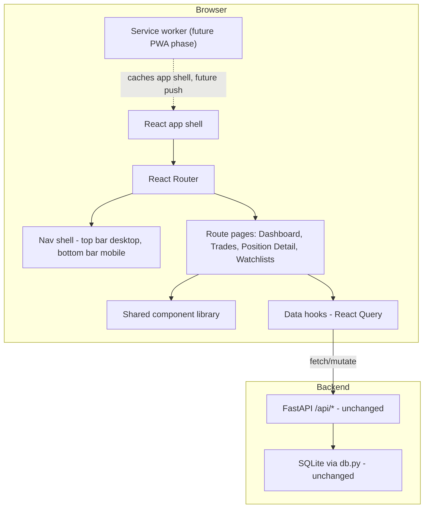
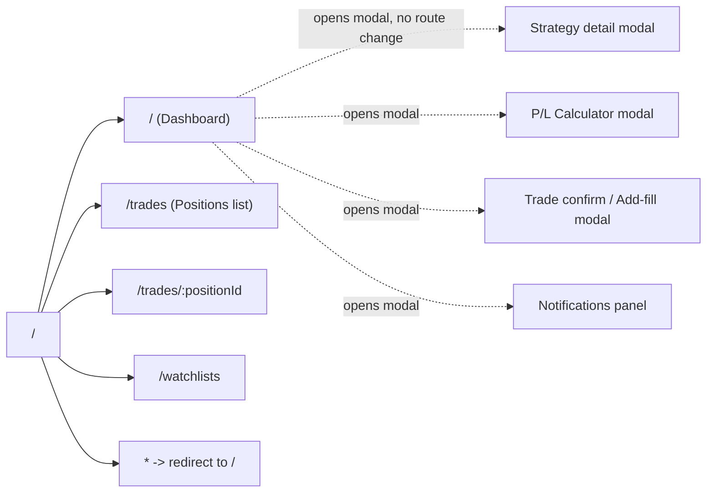
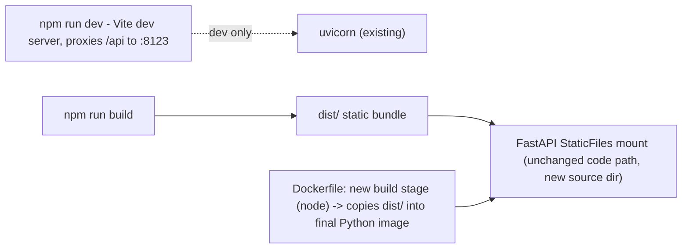

# React SPA Rewrite — Routing, Nav Shell, Components, Testing

Date: 2026-07-31
Status: Design, not implemented
Depends on: nothing (this precedes PWA work — see
[pwa-push-design.md](2026-07-31-pwa-push-design.md), which now targets the SPA shell built
here, not the current multi-page static site)
Supersedes: the current 4-file vanilla-JS frontend (`webapp/static/index.html`, `trades.html`,
`position.html`, `watchlist.html`) as the thing PWA installability wraps around

**App rename**: the app becomes **KOIL** (as in "coil" — matches the exhaustion/breakout-
setup domain this app watches for, e.g. its own "Coil Energy Build-up" pre-breakout filter)
as of this rewrite. "Exhaustion Dashboard" (the current `<title>`/header text, and the FastAPI
`title=` in `webapp/app.py`) is retired in favor of KOIL at implementation time — this doc uses
the new name throughout; the live app's actual title/branding is unchanged until this rewrite
ships, tracked as part of the migration in §8/§9, not done today.

## Background

The PWA effort's actual goal is for this app to feel like a real app on phone and desktop —
installed, with smooth navigation, a persistent nav shell, no full-page reload between views.
The current frontend is 4 independent static HTML files (~2036 + 422 + 444 + 263 = **3165
lines**), each with its own full page load, its own copy-pasted design tokens, and a fair
amount of duplicated logic (see §3). That's the wrong foundation for "feels like an app" —
PWA installability alone doesn't fix full-page reloads between Dashboard → Trades → Position
detail. This design replaces the 4 static pages with one React SPA: client-side routing, a
responsive nav shell (bottom bar on mobile, top bar on desktop), and a proper component
architecture, with unit tests as the pages are ported. PWA (manifest, service worker, push)
gets built on top of this shell once it exists, not before.

**Scope discipline**: this is a *port*, not a redesign. Every screen, filter, modal, and piece
of business logic in the current app carries over with the same behavior — the rewrite changes
*how* the UI is built and navigated, not what it does. New capability (smoother nav, shared
components, tests) is the point; new features are explicitly out of scope for this pass.

## Current state (what's being replaced)

Full inventory — API surface, page-by-page structure, duplicated logic, and the existing CSS
design tokens — was catalogued before writing this doc; the key facts that shape the
architecture below:

- **API surface**: ~20 REST endpoints under `/api/*` (FastAPI, `webapp/app.py`), covering
  tickers/dashboard data, watchlist ticker sync, positions/fills (the trade-tracking feature),
  notifications, P/L-adjacent (`estimate_entry`, PDF/CSV export). Full reference in §6.
- **Pages**: `index.html` (dashboard — by far the largest and most complex: filter bar with 3
  sub-filter popovers, paginated ticker card grid, strategy-detail modal, embedded P/L
  calculator with hand-rolled Black-Scholes + SVG payoff chart, trade-confirm/add-fill modal,
  notification bell), `trades.html` (positions table + dual-line P&L chart), `position.html`
  (single position detail — stat grid, chart, fills table with inline edit, add-fill/edit
  forms), `watchlist.html` (3 fixed named lists, localStorage-backed).
- **Duplicated across files**: the entire CSS custom-property token set (byte-identical, copy-
  pasted into all 4 `<style>` blocks), `fmtMoney`/`fmtPct`/`plClass` (with a **real
  inconsistency** — index.html's `plClass` treats exactly-0 differently from trades/
  position.html's), two different `todayIsoDate` implementations, watchlist load/save/sync
  logic, color-tier classification functions, `STRATEGY_LABELS`, and four independent hand-
  rolled SVG chart implementations with no shared charting code.
- **State model**: no client-side persistence beyond one `localStorage` key
  (`watchlists`) — everything else (filters, selection, pagination) is page-lifetime JS
  variables, lost on navigation. Watchlists are genuinely client-authoritative today (see §9)
  — the backend never returns watchlist membership, only accepts a flat ticker-liveness list.
- **No build tooling exists** — plain `<script>` tags, served via FastAPI's `StaticFiles`
  mount. This is a from-scratch frontend build, not a migration of an existing bundler setup.

## Architecture overview



The backend is **untouched** by this design — same FastAPI routes, same SQLite schema, same
background refresh loop. This is a frontend-only rewrite; `webapp/app.py` and `webapp/db.py`
stay exactly as they are. The only backend-adjacent change is how the frontend is *served*
(see §8: a built SPA bundle instead of raw static HTML files).

## Routing



Route table:

| Path | Page | Replaces |
|---|---|---|
| `/` | Dashboard | `index.html` |
| `/trades` | Positions list | `trades.html` |
| `/trades/:positionId` | Position detail | `position.html?id=` |
| `/watchlists` | Watchlists | `watchlist.html` |

Modals (strategy detail, P/L calculator, trade confirm, notifications) stay as **in-page
overlays, not routes** — they're contextual actions on the Dashboard, not distinct views a
user bookmarks or navigates back to. This matches current behavior (they're all `innerHTML`
swaps into one modal container today) and avoids over-engineering route state for things that
aren't really navigable destinations. Exception worth a deliberate call: if product wants a
notification's "view trade" action to deep-link to `/trades/:positionId`, that's a plain
`navigate()` call from within the notification list, not a modal route.

**Library**: React Router (v6 `createBrowserRouter`) — the standard choice, no reason to hand-
roll routing here given the app has exactly 4 real destinations.

## Navigation shell — mobile vs. desktop

Single `<AppShell>` component, layout switches on a CSS breakpoint (matching the existing
720px/1080px breakpoints already used in the current CSS) — not two separate component trees,
just responsive positioning of the same nav-item list.

### Desktop (≥ 1080px) — top bar

`PLCalcFab` is `position: fixed; bottom: 24px; right: 24px` — floats above page content,
unaffected by scroll or pagination, same as today's `#plCalcBtn`. Shown here offset from the
frame edge to make clear it's an overlay, not part of document flow like the other elements:

```
┌──────────────────────────────────────────────────────────────────────┐
│  [Logo] KOIL                      Dashboard  Trades  Watchlists   🔔3 │
├──────────────────────────────────────────────────────────────────────┤
│                                                                        │
│   as of 7/31 3:04pm · 1,433 tickers · 12 open trades · live  [Refresh]│
│   ┌──────────────────────────────────────────────────────────────┐   │
│   │ [Search...] [Min trades] [Advance Filter▾] [Trade On▾] [Pre▾] │   │
│   └──────────────────────────────────────────────────────────────┘   │
│                                                                        │
│   ┌────────┐  ┌────────┐  ┌────────┐                                 │
│   │ Card    │  │ Card    │  │ Card    │   (3-up grid, paginated)     │
│   └────────┘  └────────┘  └────────┘                                 │
│                                                                        │
│                        [◀ Page 2 of 14 ▶]                            │
│                                                                        │
│                                                                        │
│                                                        ╭────────────╮ │
│                                                        │ 🧮 P/L Calc │ │ <- fixed, floats
│                                                        ╰────────────╯ │    above content
└──────────────────────────────────────────────────────────────────────┘
```

### Mobile (< 720px) — bottom bar, content full-width single column

`PLCalcFab` uses the same fixed-position pattern, but its `bottom` offset must clear the fixed
bottom nav bar (`bottom: <nav-bar-height + 16px>`, not `bottom: 0`) — otherwise it overlaps the
nav bar, a common mobile-FAB mistake when a bottom tab bar is added later without re-checking
FAB placement:

```
┌───────────────────────────┐
│  KOIL                   🔔3│  <- slim top bar: title + notif bell only
├───────────────────────────┤
│ as of 3:04pm · 1,433 · 12  │
│ [Search...] [Filters ▾]    │  <- filter popovers collapse to one sheet
├───────────────────────────┤
│                             │
│  ┌───────────────────────┐ │
│  │ Card                   │ │  (1-up column)
│  └───────────────────────┘ │
│  ┌───────────────────────┐ │
│  │ Card                   │ │
│  └───────────────────────┘ │
│                             │
│      [◀ Page 2/14 ▶]       │
│                        ╭───╮│
│                        │🧮 ││ <- fixed, floats above
│                        ╰───╯│    the nav bar below it
├───────────────────────────┤
│  🏠      📊      ⭐        │  <- bottom nav bar, fixed
│ Dashboard Trades Watchlist │
└───────────────────────────┘
```

Bottom nav bar is 3 items (Dashboard / Trades / Watchlists) — matches the desktop top-bar link
set exactly, just relocated per platform convention (iOS/Android app patterns put primary nav
at the bottom; desktop web puts it at the top). The P/L Calculator is a floating action button
on both layouts (same component, `PLCalcFab`, position varies only by the CSS breakpoint's
`bottom` offset), since it's a utility/tool available from anywhere, not a primary nav
destination — it does not appear in the nav bar/top-bar link set on either layout.

## Component inventory

Organized by the "atomic" tiers the request asked for — not strict atomic-design dogma, but
the same idea: small reusable primitives at the bottom, composed upward into page-specific
sections.

### Atoms (`src/components/atoms/`)
Pure, presentational, no data fetching, no business logic.

| Component | Replaces (current) | Notes |
|---|---|---|
| `Button` | `.smallbtn`, `.tradebtn`, header action buttons | variants: default, danger, primary |
| `Chip` | `.chip.ok/.no/.mid/.neutral/.active/.pending` | color via `status` prop, not a class per call site |
| `StatBox` | `.statbox` (index/trades/position all redefine this) | label + value, optional `sub` line, optional pos/neg coloring |
| `Badge` | `.statustag`, `.kindtag` | small colored label (open/closed, entry/exit) |
| `Toggle` (segmented control) | `.togglegrp` (spot/option, entry/exit toggles) | |
| `Modal` | `#modalBackdrop`/`#modalBox` generic shell | one implementation, all current "modals" become `<Modal>` children |
| `Spinner` / `PageOverlay` | `#pageoverlay` | |
| `Input`, `Select`, `DateInput` | raw `<input>`/`<select>` throughout | thin styled wrappers, not full form library |

### Molecules (`src/components/molecules/`)
Composed from atoms, still reusable across pages, may take data as props but don't fetch.

| Component | Replaces | Notes |
|---|---|---|
| `SparklineChart` | `sparklinePath` (trades.html) | tiny inline SVG, one shared impl instead of one per page |
| `TimeSeriesChart` | `bigChartHtml` (position.html), payoff chart (index.html), PnL chart (trades.html) | **one** SVG line-chart component parameterized by series/axes, replacing 4 hand-rolled versions — biggest consolidation win in the rewrite |
| `StatGrid` | `.infogrid`/`.summarygrid` repeated pattern | array of `{label, value, sub?, tone?}` → `StatBox` grid |
| `FillRow` / `FillsTable` | `fillsTableHtml` + inline edit row (position.html) | |
| `NotificationItem` | notification list row (index.html) | |
| `StrategyBadgeRow` | `statBadges`/`statBadgesHtml` (index.html + watchlist.html, currently 2 slightly different signatures) | one component, superset props |

### Organisms (`src/components/organisms/`)
Page sections — feature-scoped, may use data hooks directly.

| Component | Replaces |
|---|---|
| `TickerCard` | one card in the `#rows` grid (index.html) |
| `TickerCardGrid` + `Pagination` | `#rows` + `#pager` + `render()`'s sort/paginate logic |
| `FilterBar` (+ `AdvanceFilterPanel`, `TradeOnPanel`, `PrebreakFilterPanel`) | the 3 popover filter panels |
| `StrategyDetailModal` | `strategyModal()` |
| `PLCalculatorModal` (+ `SpotCalcForm`, `OptionsCalcForm`) | the ~395-line embedded P/L calculator |
| `TradeConfirmModal` / `AddFillModal` | `showTradeModal`/`showAddFillModal` |
| `NotificationBell` + `NotificationPanel` | bell badge + notification list modal |
| `PositionsTable` | `trades.html`'s main table |
| `PositionDetailHeader`, `AddFillForm`, `EditPositionForm` | `position.html` sections |
| `WatchlistColumn` | one column of `watchlist.html` |

### Pages (`src/pages/`)
Route targets, compose organisms, own top-level data fetching via hooks.

`DashboardPage`, `TradesPage`, `PositionDetailPage`, `WatchlistsPage`.

## State, data-fetching, and business-logic layers

```
src/
├── api/                 # thin fetch wrappers, one file per resource, typed request/response
│   ├── client.ts        # base fetch wrapper (JSON, error handling, no auth needed today)
│   ├── tickers.ts        # /api/tickers, /api/meta, /api/watchlist-tickers
│   ├── positions.ts      # /api/positions*, /api/positions/{id}/fills*
│   ├── notifications.ts  # /api/notifications*
│   └── plCalc.ts          # /api/estimate_entry, /api/export/*
├── hooks/                # React Query hooks wrapping api/ calls
│   ├── useTickers.ts      # polling behavior ported from load()/checkForBackgroundRefresh
│   ├── usePositions.ts
│   ├── usePosition.ts     # single position + fills + marks
│   ├── useNotifications.ts
│   └── useWatchlists.ts   # localStorage read/write + backend sync, see §9
├── lib/                  # pure functions, no React, no fetch -- unit-test heavy
│   ├── format.ts          # fmtMoney, fmtPct, plClass (RECONCILED, see below), stratLabel
│   ├── dates.ts            # todayIsoDate, daysBetween, addDaysIso (ONE impl, not two)
│   ├── blackScholes.ts     # normCdf, normPdf, blackScholes -- ported verbatim from index.html
│   ├── filters.ts          # matchesAdvFilter, matchesPrebreakFilter, activeMinTradesStrats
│   ├── sorting.ts          # the 3-tier ticker sort from render()
│   └── colorTiers.ts       # wrColorClass, pfColorClass, tradeCountColorClass
├── constants/
│   ├── strategy.ts         # STRATEGY_LABELS, ADV_STRAT_KEY -- ONE definition, not 3
│   └── filterDefaults.ts   # WR_STEPS, PF_STEPS, PHASE_STEPS, COIL_STEPS, defaults
├── components/
│   ├── atoms/
│   ├── molecules/
│   └── organisms/
├── pages/
├── router.tsx
├── theme.css               # the 15 design tokens x 2 modes, ONE file
└── App.tsx                 # AppShell + RouterProvider
```

**`lib/` is the deliberate home for every duplicated function found in the audit** — each one
gets exactly one implementation, unit-tested, imported everywhere. The `plClass` inconsistency
(index.html treats `0` as neutral, trades/position.html treat `0` as positive) needs an actual
product decision, not a silent pick — flagged as an open question in §10.

**Data fetching**: React Query (`@tanstack/react-query`) for all `/api/*` calls — gives caching,
polling (`refetchInterval` replaces the hand-rolled `setInterval` polling in
`checkForBackgroundRefresh`/`pollUnreadNotifications`), and mutation state (loading/error) for
free, replacing the manual `try/catch`/`errEl.textContent` pattern repeated at every form
submit today.

## API reference (unchanged surface, for hook design)

Full endpoint catalogue the `api/` layer wraps — every route currently in `webapp/app.py`,
grouped by the `hooks/` file that owns it:

**`api/tickers.ts` / `useTickers.ts`**
- `GET /api/meta` — `{total_tickers, last_fetch, fetch_progress, compute_progress,
  rate_limited_until}` — polled during active fetch/compute (was: `startRealProgressPolling`)
- `GET /api/tickers?refresh=0|1` — `{asof, cached, tickers, errors, universe_error}` — the
  main dashboard data
- `POST /api/watchlist-tickers` — body: `string[]` — fire-and-forget liveness sync

**`api/positions.ts` / `usePositions.ts` / `usePosition.ts`**
- `POST /api/positions` — create position from first fill
- `POST /api/positions/{id}/fills` — add entry or exit fill
- `GET /api/positions?status=` — list with derived state
- `GET /api/positions/summary` — win rate / avg return
- `GET /api/positions/analytics?ticker=&status=&date_from=&date_to=` — currently unused by any
  page (trades.html/position.html assemble the same data from `/api/positions` +
  `/fills`/`/marks`) — **decide during implementation** whether the SPA's PnL chart should
  finally consume this (moving the replay math server-side, removing the client-side
  `computePnlSeries`/`replayAsOf` duplication of `replay_fills`) or keep the current client-
  side approach. Recommendation: move to server-side, see §10.
- `GET /api/positions/{id}` — single position
- `PATCH /api/positions/{id}` — edit tp/stop/notes
- `DELETE /api/positions/{id}` — cancel (hard delete)
- `PATCH /api/positions/{id}/fills/{fillId}` — correct a fill
- `DELETE /api/positions/{id}/fills/{fillId}` — delete a fill
- `GET /api/positions/{id}/fills` — raw fill list
- `GET /api/positions/{id}/marks` — daily marks, option-value-annotated

**`api/notifications.ts` / `useNotifications.ts`**
- `GET /api/notifications?unread=0|1`
- `POST /api/notifications/{id}/read`

**`api/plCalc.ts`**
- `POST /api/estimate_entry` — body `{ticker, strategy}`
- `POST /api/export/pdf`, `POST /api/export/csv` — body `{tickers, strategy, timezone}`,
  binary response with `Content-Disposition` filename (port `runExport`'s blob-download logic)

No backend changes needed for any of the above — this is purely how the frontend consumes an
already-complete API.

## Testing

| Layer | Tool | What gets tested |
|---|---|---|
| `lib/*.ts` pure functions | Vitest | Every function in `lib/` — format, dates, blackScholes, filters, sorting, colorTiers. High-value, cheap: this is where the current app's actual business logic lives, and it's currently **completely untested**. |
| Components (atoms/molecules) | Vitest + React Testing Library | Render + interaction tests — e.g. `Toggle` fires `onChange`, `StatBox` renders pos/neg coloring correctly, `TimeSeriesChart` renders the right number of points |
| Organisms/pages | Vitest + RTL, mocked API layer (MSW) | `FilterBar` narrows the ticker list correctly, `PLCalculatorModal` computes the same numbers the old hand-verified Black-Scholes did (regression-test against known-good values from the current implementation's manual test sessions) |
| Critical flows | Playwright (already used ad hoc for manual verification this session) | Confirm a trade end-to-end, add a fill, partial exit, navigate Dashboard → Trades → Position detail and back — promote the existing manual Playwright scripts used during backend verification into a real `e2e/` suite instead of throwaway scratchpad scripts |

`lib/` unit tests are the non-negotiable minimum — every one of the duplicated/subtly-
inconsistent functions found in the audit (§3) gets a test that pins its correct behavior,
which is exactly what would have caught the `plClass(0)` inconsistency before it shipped three
times.

## Packages

```jsonc
// package.json (new, at repo root or webapp/frontend/ -- see §8 for placement)
{
  "dependencies": {
    "react": "^18",
    "react-dom": "^18",
    "react-router-dom": "^6",
    "@tanstack/react-query": "^5"
  },
  "devDependencies": {
    "vite": "^5",
    "@vitejs/plugin-react": "^4",
    "typescript": "^5",
    "vitest": "^2",
    "@testing-library/react": "^16",
    "@testing-library/jest-dom": "^6",
    "msw": "^2",
    "@playwright/test": "^1"
  }
}
```

Deliberately **not** pulling in: a UI component library (Chakra/MUI/etc — the existing design
is small and specific enough that the atoms/molecules tier above covers it without a heavy
dependency), a CSS-in-JS library (plain CSS + the existing custom-property token system already
works and needs no framework), a state-management library beyond React Query (no state here is
complex enough to need Redux/Zustand — page-local `useState`/`useReducer` plus React Query's
cache is sufficient), a charting library (the current SVG charts are simple enough that one
shared hand-rolled `TimeSeriesChart` component is less weight than e.g. Recharts/visx for what
these charts actually need — 2-4 line series, no zoom/brush/tooltip complexity beyond what's
already hand-built).

## Build & deploy integration



- **Dev**: Vite's dev server proxies `/api/*` to the existing `uvicorn` process (no change to
  how the Python backend runs locally) — `npm run dev` alongside `.\.venv\Scripts\python.exe -m
  uvicorn webapp.app:app --port 8123` (per this project's existing documented run command).
- **Build**: `npm run build` emits a static `dist/` bundle; `webapp/app.py`'s existing
  `app.mount("/", StaticFiles(...))` line changes its source directory to point at the built
  bundle instead of `webapp/static/` directly — no other backend code changes.
- **Docker**: the current single-stage Python `Dockerfile` gains a `node:20` build stage that
  runs `npm ci && npm run build`, then `COPY --from=build /app/dist ./webapp/static-dist` (or
  similar) into the final Python stage — same deploy flow (`deploy.sh`, `docker compose up -d
  --build`) otherwise unchanged.
- **Where the frontend source lives**: recommend `webapp/frontend/` (new directory, sibling to
  the existing `webapp/static/` which becomes build output only) — keeps the whole project in
  one repo/one deploy unit, matching how this project already works, rather than splitting into
  a separate frontend repo.

## Migration plan (page-by-page, incremental)

Not a big-bang rewrite — port one page at a time behind the same running backend, so the app
stays usable throughout.

1. **Scaffold**: Vite + React + Router + the `theme.css` token file + `AppShell` with nav (both
   layouts) + empty route stubs. `lib/` functions ported first, with unit tests, since every
   page depends on them.
2. **Watchlists page** — smallest, simplest, good first real port (validates the
   `useWatchlists` localStorage-sync pattern before the bigger pages need it).
3. **Trades + Position Detail pages** — medium complexity, most recently built so freshest in
   mind, validates the `usePositions`/`usePosition` hooks and the shared `TimeSeriesChart`.
4. **Dashboard page** — largest, done last, once patterns are proven: ticker grid + pagination,
   then the 3 filter panels, then the strategy modal, then the P/L calculator (biggest single
   chunk), then trade-confirm/add-fill, then notifications.
5. **Cutover**: swap the `StaticFiles` mount to the built bundle; keep the old `webapp/static/*
   .html` files in git history (not deleted from the repo until the SPA has run in prod without
   issues) as a rollback reference, but they stop being served.

## Explicitly out of scope

- **PWA installability itself** (manifest, service worker, push) — this doc only builds the
  shell PWA work will wrap; see [pwa-push-design.md](2026-07-31-pwa-push-design.md), which
  should be revisited once this ships since it currently describes adding a manifest/service
  worker to the old static-HTML app.
- **New features or UX changes** — every screen ports with identical behavior; this is
  explicitly a *rewrite*, not a redesign.
- **Multi-device watchlist sync** — flagged as an open question (§10), not solved here.
- **Authentication/multi-user** — this app has none today and none is added by this rewrite.
- **Server-side rendering** — a client-rendered SPA is sufficient; this app has no SEO
  requirement and is always used authenticated-equivalent (LAN/personal tool).

## Open questions for the user

1. **`plClass(0)` inconsistency**: index.html treats an exact-zero P&L as neutral; trades.html
   and position.html treat it as positive. Which is correct for the unified `lib/format.ts`
   implementation?
2. **PnL chart computation**: should the SPA's Trades-page daily P&L chart keep the current
   client-side replay (`computePnlSeries`/`replayAsOf`, a JS re-implementation of the backend's
   `replay_fills`), or should `/api/positions/analytics` (currently unused) be extended to
   return the daily realized/unrealized series server-side, removing the duplication? Recommend
   moving server-side during this rewrite, since maintaining two implementations of the same
   accounting math is exactly the kind of drift risk this rewrite is trying to eliminate
   elsewhere.
3. **Watchlist multi-device sync**: acceptable to keep watchlists client-only (localStorage,
   no cross-device sync) as today, or should this rewrite also add a real backend-stored
   watchlist model? Currently scoped as "keep as-is" (§8, out of scope) pending your answer.
