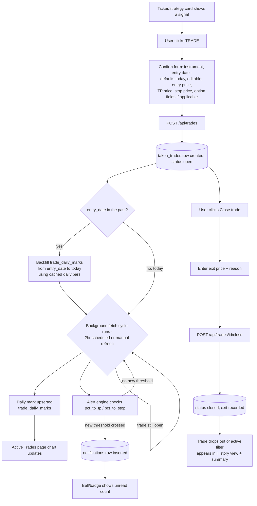
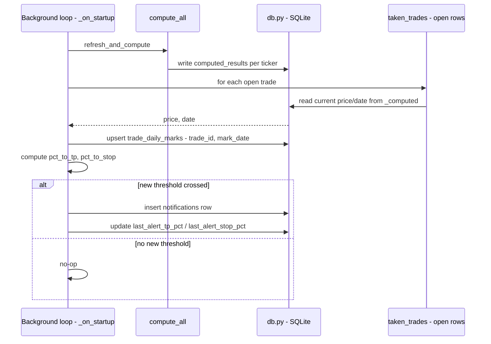

# Trade Tracking & TP/Stop Notifications — Design

Date: 2026-07-31
Status: Design, not implemented

## Background

Today the dashboard only ever shows *simulated* state. `open_position` (built by
`strategy_common.build_open_position()`, `webapp/strategy_common.py:140-155`) is recomputed
from scratch on every `compute_all()` pass off historical bars — it answers "if the backtest's
sizing rules were still in a trade as of the last bar," not "did the user actually take this
trade." There is no persistence for a real decision, no history of real entries/exits, and no
alerting. This design adds all three:

1. A way to confirm a signal was actually traded — spot or option, with the required fields
   for each — and have that persist independently of the ticker recompute cycle.
2. Tracking that confirmed trade through to a manually-recorded exit, filterable as "active
   trades," with a summary and full history view.
3. A daily close-price series per open trade, captured for free off the existing fetch cycle,
   powering per-trade and aggregate analytics/charts in the active-trades page.
4. In-app notifications when the underlying stock price crosses threshold distances toward the
   user's TP or stop (30/50/70/80/90/95%). Push notifications (PWA) are explicitly **out of
   scope** here — flagged as a separate future architecture pass once a service worker/manifest
   exists.

## Decisions from stakeholder review

- **Alert basis is always the underlying stock price**, never the modeled option price — even
  for option trades. TP/stop are prices the user enters manually against the stock, so they're
  already accurate and user-validated; re-deriving an option-price-based alert would need
  tracked IV and constant Black-Scholes recompute for no real benefit.
- **Entry point is a "TRADE" button on each ticker/strategy card**, not a separate flow or an
  extension of the P/L Calculator modal.
- **Exit recording is manual only.** No auto-close on TP/stop cross — real fills rarely match
  the modeled level exactly (slippage, partials, discretionary exits), so the system alerts but
  never assumes the exit price on the user's behalf.

## Flow: trade lifecycle



## Flow: background cycle write path



## Data model

New SQLite table `taken_trades` (via `webapp/db.py`, following the existing single-connection
+ `threading.Lock` pattern used for `bars`/`computed_results`/etc.):

```
id                  INTEGER PRIMARY KEY
ticker              TEXT
strategy_key        TEXT            -- 'vexh' | 'strategy_vcp' | 'strategy_vcpo'
signal_date         TEXT            -- date of the signal being acted on
instrument          TEXT            -- 'spot' | 'option'
entry_date          TEXT            -- user-entered, YYYY-MM-DD; the actual date the trade was taken
entry_price         REAL            -- stock price at entry, always required
tp_price            REAL            -- user-entered, drives all alerting
stop_price          REAL            -- user-entered, drives all alerting
-- option-only, NULL for instrument='spot'
opt_side            TEXT            -- 'buy' | 'sell'
opt_type            TEXT            -- 'call' | 'put'
strike              REAL
premium             REAL
contracts           INTEGER
expiry_date         TEXT
iv_at_entry         REAL
confirmed_at        TEXT            -- timestamp the row was created (form-submit time,
                                     -- may be later than entry_date for late-logged trades)
status              TEXT            -- 'open' | 'closed'
exit_price          REAL
exit_reason         TEXT            -- 'tp' | 'stop' | 'manual'
closed_at           TEXT
last_alert_tp_pct    REAL           -- highest TP-side threshold already fired
last_alert_stop_pct  REAL           -- highest stop-side threshold already fired
notes               TEXT
```

`(ticker, strategy_key, signal_date)` is a natural dedup key — confirming twice against the
same signal should update, not duplicate.

New table `trade_daily_marks` — one row per open trade per calendar day, capturing the close
price as of the most recent fetch that day:

```
id           INTEGER PRIMARY KEY
trade_id     INTEGER  -- FK to taken_trades.id
mark_date    TEXT     -- YYYY-MM-DD, the fetch's bar date (not wall-clock time)
close_price  REAL     -- ticker's close as of that fetch
updated_at   TEXT     -- timestamp of the fetch that produced this row (for debugging, not display)
```

`(trade_id, mark_date)` is a unique constraint — an `INSERT ... ON CONFLICT DO UPDATE` (upsert)
keyed on that pair gives the "add if missing, update if same day" behavior directly: whichever
fetch (manual or the 2-hour scheduled cycle) last touched a given day wins, and intraday
manual refreshes before market close simply overwrite that day's row until the close print
settles. No separate "is this the final close" flag is needed — the last fetch of the day is
definitionally the best available close, scheduled or manual.

New table `notifications`:

```
id           INTEGER PRIMARY KEY
trade_id     INTEGER  -- FK to taken_trades.id
kind         TEXT     -- 'tp_progress' | 'stop_progress'
pct          REAL     -- threshold that fired (30/50/70/80/90/95)
message      TEXT
created_at   TEXT
read_at      TEXT     -- NULL until viewed
```

## API surface

All in `webapp/app.py`, alongside the existing `/api/*` routes:

- `POST /api/trades` — confirm a trade taken. Body carries instrument + required fields per
  the table above. Returns the created row.
- `GET /api/trades?status=open|closed` — list, used both for the "active trades" filter and
  the history view.
- `PATCH /api/trades/{id}` — edit TP/stop (or notes) after entry.
- `POST /api/trades/{id}/close` — record manual exit (`exit_price`, `exit_reason`).
- `GET /api/trades/summary` — aggregate stats (open count, closed count, win rate, avg
  return) computed from closed rows.
- `GET /api/trades/{id}/marks` — daily close-price series for one trade (for its chart).
- `GET /api/trades/analytics?strategy=&ticker=&from=&to=` — aggregate daily series across a
  filtered set of trades (all trades, one strategy, or one ticker), for the combined
  chart/date-range view. Optional filters compose; omitting all of them returns every trade.
- `GET /api/notifications?unread=1` — list for the notification page/bell.
- `POST /api/notifications/{id}/read` — mark read.

## UI

- **TRADE button** on each ticker/strategy card (next to where `open_position` is currently
  displayed). Opens an inline confirm form: instrument toggle (spot/option), **entry date**
  (defaults to today, editable — covers logging a trade after the fact), entry price
  (prefilled from current price, editable), TP price, stop price; option instrument reveals
  strike/premium/contracts/expiry/side/type — reusing the same field set already established
  by the P/L Calculator (`webapp/static/index.html` `optionsFormHtml()`, `:543`) for
  consistency, though this is a separate, persisted form, not the calculator itself.
- Cards with an open `taken_trades` row get a visual badge; a dashboard-level filter toggle
  shows "active trades only."
- A "Close trade" action on the card opens the manual exit form (exit price, reason).
- **Notifications page**: simple unread/read list backed by `GET /api/notifications`, with a
  bell/badge indicator elsewhere in the UI showing unread count.
- **History view**: table of closed trades from `GET /api/trades?status=closed`, plus the
  summary stats from `/api/trades/summary`.
- **Active Trades page** (new): the filtered "active trades only" list, each with a small
  daily close-price chart (from `GET /api/trades/{id}/marks`) overlaying entry/TP/stop as
  reference lines. Above the list, a combined view driven by `/api/trades/analytics` — filter
  by strategy, ticker, or date range, rendered as one aggregate chart (e.g. average % move
  from entry across the filtered trades, indexed by days-held) so the user can compare how a
  strategy's live trades are tracking as a cohort, not just individually.

## Daily mark capture

Hooked into the same background loop, immediately after `compute_all()` finishes each cycle
(both the scheduled 2-hour run and a manual `GET /api/tickers?refresh=1` — same code path,
see `app.py:_on_startup` / `refresh_and_compute()`). For every `taken_trades` row with
`status='open'`, read that ticker's `price` and `date` already present in `_computed` (no new
Yahoo Finance call) and upsert into `trade_daily_marks` on `(trade_id, mark_date=date)`. This
piggybacks on the existing fetch cadence exactly as specified — no separate schedule, no extra
API calls, and manual refreshes naturally keep same-day marks current intraday.

Marks only begin accumulating from the moment a trade is confirmed — a late-logged trade (e.g.
`entry_date` is three days in the past) has no marks for the gap between `entry_date` and
`confirmed_at`, since no fetch cycle ran against it while it didn't exist in `taken_trades`
yet. That gap is filled once, at confirm time: `POST /api/trades` backfills
`trade_daily_marks` for each trading day from `entry_date` up to (not including) today, using
the ticker's existing cached daily bars (`data.get_bars()` — the same OHLCV history already
warmed for strategy computation, no new fetch needed). From confirmation onward, the regular
background-loop upsert takes over.

## Alert engine

Runs in the same hook, right after the daily-mark upsert step (same background loop —
`app.py:_on_startup`, currently a 2-hour `refresh_and_compute()` cycle, see
`webapp/data.py:39` `CHECK_INTERVAL`).

For every `taken_trades` row with `status='open'`, look up the ticker's current price already
present in `_computed` (no new Yahoo Finance calls — reuses the existing cache per the
established rate-limit discipline, see `webapp/data.py` / `app.py:91,305-309`
`RATE_LIMIT_BACKOFF`). Compute progress toward each side, sign-aware for long vs. short:

```
pct_to_tp   = (current_price - entry_price) / (tp_price - entry_price)   * 100
pct_to_stop = (entry_price - current_price) / (entry_price - stop_price) * 100
```

For each side, walk the threshold list `[30, 50, 70, 80, 90, 95]` and fire (insert a
`notifications` row, update `last_alert_{tp,stop}_pct`) only for the highest threshold newly
crossed since the last stored value — guarantees each band notifies exactly once per trade per
direction, even though the loop re-evaluates every cycle.

## Explicitly out of scope

- Push notifications / PWA (manifest, service worker, VAPID keys, subscription storage) — a
  separate future design once the app is made installable.
- Auto-detecting/auto-closing trades on TP/stop cross.
- Deriving alert thresholds from modeled option price/Greeks.
- Backfilling `taken_trades` from historical `open_position` snapshots — this only tracks
  trades confirmed going forward.
