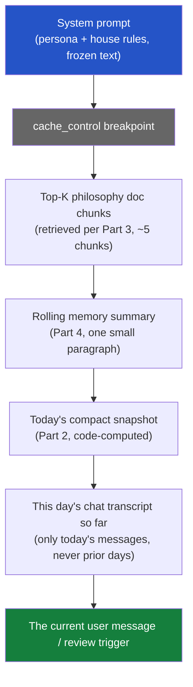
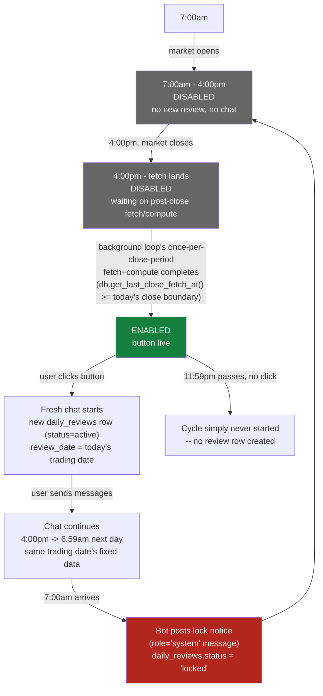

# Daily trade review chatbot — design (future work, not scheduled)

## What's wanted

A new feature, behind a feature flag: a new dedicated page ("Analyzer")
with a button that triggers a "daily review" — Claude looks at the user's
current trades, the app's strategy/screener data, and the user's own
investment-philosophy document (a PDF/doc/markdown file they already
have, brought into the app once), and produces a summary judgment. The
user can then ask follow-up questions in a chat thread tied to that
review. There is always exactly **one** active chat context — a fresh one
each trading day, gated to when the day's closing data is actually final
(see Part 7 for the precise time-window state machine). Reviews and their
chats persist day over day, so the bot can reference "last Tuesday you
were worried about X" — but the whole thing has to stay cheap: context
has to be actively managed, not just piled up and resent every turn, or
token cost grows unbounded with usage.

This doc has nothing to do with `backend/pdf_export.py` (the app's own
report-generation module, which writes PDFs, never reads them) — that's a
separate, unrelated piece of code. This is new territory: PDF ingestion,
a chat data model, and a context-assembly strategy, none of which exist in
the codebase today.

## Designed user-scoped from day one, real auth or not

Per `docs/superpowers/specs/2026-08-04-multi-user-trades-design.md`
(future work, also not scheduled), every table this feature introduces
carries `user_id INTEGER NOT NULL` from the start — same convention that
doc already settled on for `positions`/`push_subscriptions`/
`watchlist_tickers`. There is no real auth today, so every write and read
in this feature uses a single hardcoded constant instead of a resolved
session user:

```python
# backend/app.py or a shared constants module
DEFAULT_USER_ID = 1
```

Every insert/query in Parts 1 and 4 below includes `user_id`, populated
from `DEFAULT_USER_ID` everywhere a real app would use
`current_user.id`. This means:

- **Zero schema migration when real multi-user auth eventually lands** —
  the columns already exist, already `NOT NULL`, already indexed. The
  multi-user doc's own migration plan (backfill existing rows to a single
  default user) is *already satisfied* for this feature's tables, since
  they were born with `user_id = 1` rather than needing a retrofit.
- **Only the code that RESOLVES `user_id` changes later** — swap
  `DEFAULT_USER_ID` for whatever `Depends(get_current_user)` (or
  equivalent) resolves to, per endpoint. The queries, the schema, the
  retrieval logic, the rolling-summary logic — none of it changes shape.
- **Multiple people using the app today** (before real auth) would
  currently collide on `user_id = 1` — same limitation the whole app has
  today (one shared `positions` table), not something this feature makes
  worse. Not a regression to solve here.

This is the only cross-cutting change from the first draft — everything
else below is unchanged in shape, just with `user_id` added to each table
and each query.

## Answering the four questions directly

1. **Where does the initial PDF context live?** On disk (a persistent Docker
   volume, same pattern as `backend/app_data.db` today), parsed once into
   plain text, chunked, and the chunks stored in SQLite — never re-parsed
   from the raw PDF on every chat turn. See Part 1.
2. **How does the chatbot get current app data + memory of past patterns?**
   Current data is assembled fresh, cheaply, per request, from the DB's
   already-existing structured tables (positions, fills, strategy verdicts)
   — never sent as a raw dump, always as a compact computed summary. Past
   patterns come from a rolling **review-of-reviews** summary, updated
   incrementally, not from resending every prior day's full transcript. See
   Part 2 and Part 4.
3. **What's the similarity/retrieval strategy?** Embed the philosophy
   document's chunks once at ingest time; embed each day's review once at
   creation time; retrieve by cosine similarity against the current query
   at chat time, top-K only. See Part 3.
4. **What's the overall context-moderation strategy?** A layered budget —
   frozen system context (cached), a small retrieved slice of the
   philosophy doc, a compact current-state summary, a compact recent-memory
   summary, and only the current day's live chat turns in full. Nothing
   else is ever in the prompt. See Part 5.

## Part 1 — Storing the initial philosophy document

### Where the PDF itself lives

**On disk, not in the DB, not in git.** A new persistent volume, mounted
the same way `backend/app_data.db` already is in `docker-compose.yml`:

```yaml
volumes:
  - ./backend/app_data.db:/app/backend/app_data.db          # existing
  - ./backend/user_docs:/app/backend/user_docs                # new
```

The raw PDF is kept (not discarded after parsing) so it can be re-parsed
later if the extraction/chunking logic improves, without asking the user
to re-upload. It is never committed to git (add to `.gitignore`, same as
`app_data.db` already presumably is) and never sent to Claude as a raw
file on every request — see below for why.

### Why not just attach the PDF to every Claude request

The `document` content-block API (base64 PDF, or Files API `file_id`) is
the obvious first instinct, but it's wrong for a **recurring daily**
feature specifically because of the cost model:

- A PDF re-attached (even via `file_id`, which avoids re-uploading bytes
  but does NOT avoid re-processing them into context) costs input tokens
  **every single request** it's included in. A daily review, run for
  months, re-pays for the same static document hundreds of times.
- The philosophy document doesn't change day to day — it's exactly the
  kind of large, static content prompt caching exists for, but caching
  only helps within a TTL window (5min–1h); it does not help across a
  once-a-day trigger separated by many hours.
- Only a fraction of the document is usually relevant to any single day's
  review (e.g. today's review might only need the user's stated rules
  about position sizing and exit discipline, not their entire risk-
  tolerance essay or the parts about asset classes they don't currently
  hold).

The right pattern for "large static reference document, small relevant
slice needed per request, requests recur indefinitely" is **parse once,
embed once, retrieve the relevant slice per request** — RAG, not
re-attachment. This is also exactly why Part 3 (retrieval) exists.

### Parsing and chunking, once, at upload time

1. User uploads the philosophy document once, via a new (feature-flagged)
   settings/upload endpoint. **Accepted formats: `.pdf`, `.docx`, `.md`/
   `.txt`** — dispatch on file extension/MIME type to the right extractor:
   `pypdf`/`pdfplumber` for PDF, `python-docx` for Word, plain read for
   Markdown/text. If a PDF turns out to be scanned/image-based, fall back
   to the Claude API's native PDF support (`document` content block,
   one-time call, NOT repeated per chat turn) for that one-time extraction
   pass.
2. Chunk the extracted text — target ~500–800 tokens per chunk, with
   modest overlap (~50–100 tokens) so a concept split across a chunk
   boundary isn't lost entirely in either chunk. Simple paragraph/heading-
   aware chunking is enough here; this is a personal philosophy document,
   not a large corpus needing sophisticated semantic chunking.
3. Each chunk is embedded once (see Part 3) and stored with
   `source = 'upload'` (see below — distinguishes original-document chunks
   from later enrichment chunks).

### The document is a living memory store, not a static one-time upload

Per the user's clarification: **upload happens once**, but what's
retrievable keeps growing afterward — the same `document_chunks` table
that holds the original document's chunks also holds later **enrichment
chunks**, added two ways:

- **Automatic**: after each daily review is generated (Part 4), a small
  extraction step asks "is there anything here specific and durable
  enough to remember going forward?" (a trade-specific observation, a
  stated preference, a pattern worth flagging) and, if so, appends it as
  a new chunk — same embedding/retrieval path as the original document,
  just tagged with a different `source`.
- **User-triggered**: mid-chat, the user can explicitly ask the bot to
  remember something ("remember that I don't want to average down on
  biotech names") — recognized via a dedicated tool call (see Part 6)
  rather than parsed from free text, so it's a clear, auditable action
  with its own DB row, not a heuristic guess at intent.

This means `document_chunks.document_id` becomes nullable — an
enrichment chunk isn't tied to the original uploaded file, it's tied to
the review or chat message that produced it instead:

```sql
-- document_chunks, updated:
CREATE TABLE document_chunks (
    id INTEGER PRIMARY KEY AUTOINCREMENT,
    user_id INTEGER NOT NULL,
    document_id INTEGER REFERENCES user_documents(id),   -- NULL for enrichment chunks
    source TEXT NOT NULL,             -- 'upload' | 'auto_enrichment' | 'user_enrichment'
    source_review_id INTEGER REFERENCES daily_reviews(id),  -- set for enrichment chunks, NULL for 'upload'
    chunk_index INTEGER,              -- order within the document; NULL for enrichment chunks
    content TEXT NOT NULL,
    embedding BLOB NOT NULL,
    created_at TEXT NOT NULL
);
CREATE INDEX idx_document_chunks_document ON document_chunks(document_id);
CREATE INDEX idx_document_chunks_user ON document_chunks(user_id);
```

Retrieval (Part 3) doesn't need to treat `source` specially — an
enrichment chunk about "I don't average down on biotech" is exactly as
retrievable, by the same cosine-similarity search, as an original
philosophy-document chunk about position sizing. The `source` column
exists for transparency/debugging (so the user or a future settings UI
can tell what came from the original upload vs. what the bot learned
later), not to change retrieval behavior.

### New DB table (document metadata only — see above for `document_chunks`)

```sql
CREATE TABLE user_documents (
    id INTEGER PRIMARY KEY AUTOINCREMENT,
    user_id INTEGER NOT NULL,        -- DEFAULT_USER_ID today; real FK once auth lands
    filename TEXT NOT NULL,
    file_path TEXT NOT NULL,        -- path under the persistent volume
    file_type TEXT NOT NULL,        -- 'pdf' | 'docx' | 'md' | 'txt'
    uploaded_at TEXT NOT NULL,
    status TEXT NOT NULL             -- 'processing' | 'ready' | 'failed'
);
CREATE INDEX idx_user_documents_user ON user_documents(user_id);
```

Per the user's decision (upload once, no version-management UI): a
`user_documents` row is created once per user and not expected to be
replaced routinely. If the user does re-upload, the newer `status='ready'`
row becomes active; old chunks are not deleted (kept for the review
history that already referenced them), but this is not a designed/exposed
workflow for v1 — just a consequence of not hard-blocking a second upload.

### First-visit onboarding prompt — once per user's lifecycle, ever

The very first time the Analyzer page is opened, the user sees an
upload-or-skip prompt: upload the philosophy document now, or explicitly
choose "start clean" (no document — the bot works from app data +
whatever gets enriched into memory over time, per Part 6, without an
initial philosophy baseline). Whichever path they pick, **this prompt
must never appear again** — not "until they upload," but permanently,
for the lifetime of their account.

This can't be gated on "does a `user_documents` row exist," because
"start clean" is a valid, permanent choice that deliberately produces no
row — checking for a row's existence can't distinguish "hasn't decided
yet" from "decided to skip." A separate decision marker is needed, and
since there's no real per-user account system yet (same
`DEFAULT_USER_ID` situation as everywhere else in this design), the
simplest correct answer for now is an **env var, toggled manually**:

```
# .env
DAILY_REVIEW_ONBOARDED=false   # flip to true by hand, once, after the
                                 # user uploads or explicitly skips
```

- `GET /api/review/status` (or a small dedicated
  `GET /api/review/onboarding-status`) reports this flag's current value
  to the frontend; the Analyzer page shows the upload-or-skip prompt only
  when it's `false`.
- There is deliberately **no API endpoint that flips it** — per "manual,"
  this is a human action (edit `.env`, restart), same operational model
  as every other flag in this app today. The frontend's "start clean"
  button doesn't call an endpoint that sets a DB row and moves on; it
  surfaces a one-time instruction ("tell your operator to set
  `DAILY_REVIEW_ONBOARDED=true`" — or, more realistically for a
  single-operator app, this is the point where flipping the var by hand
  in the deployed `.env` is just the actual next step, not something the
  UI needs to fully automate for v1).
- **This is explicitly a placeholder for real per-user state.** Once
  actual accounts exist (`docs/superpowers/specs/2026-08-04-multi-user-trades-design.md`),
  this single global boolean is replaced by a real
  `users.onboarded_at` column (or similar) — same "hardcoded env var
  today, real per-user column later" pattern as `DEFAULT_USER_ID` itself,
  not a new kind of technical debt this feature introduces on its own.

## Part 2 — Getting current app data into the review

This is the one part that's genuinely easy, because the data already
exists in exactly the structured form needed — no new fetch/compute
pipeline, just a read-and-summarize step.

### What "current app data" means, concretely

- **Real trades**: `db.list_positions("open")` + `db.list_fills(id)` per
  position — avg cost, units, TP/stop, realized/unrealized P&L (same
  numbers already shown on the Trades page).
- **Strategy/screener state**: for each ticker the user holds or
  watchlists, that ticker's current `verdict` per strategy (already
  computed and stored in `computed_results`, from the
  `strategy_state`-alert work done earlier this session) — no new
  computation, just a read.
- **Recent notifications**: today's `strategy_state`/`tp_progress` alerts
  already in the `notifications` table.

### Why this must be summarized, not dumped raw

A user with 15 open positions, each with several fills, plus 3 strategies'
worth of verdict/score data per ticker, is a genuinely large JSON blob if
sent verbatim. The fix is the same principle as Part 1: **compute a
compact summary server-side, in code, before it ever reaches Claude** —
not "send everything and let the model figure out what matters." A
Python function assembles a few-hundred-token structured summary (ticker,
side, days held, unrealized %, whether it's near TP/stop, current
strategy verdict) — Claude receives the *conclusion* of a database query,
not the database.

```python
def build_daily_snapshot(user_id: int = DEFAULT_USER_ID) -> dict:
    """Compact, code-computed summary of current trade state -- NOT raw
    DB dump. This is what actually goes in the prompt."""
    positions = db.list_positions("open", user_id=user_id)  # once positions carry user_id (multi-user doc); today just DEFAULT_USER_ID's rows
    return {
        "open_positions": [
            {
                "ticker": p["ticker"],
                "instrument": state["instrument"],
                "units": state["units_remaining"],
                "unrealized_pct": ...,       # already-existing calc, reused
                "days_held": ...,
                "near_tp_or_stop": ...,      # bool, from existing threshold logic
                "strategy_verdict": ...,     # current verdict per strategy, if any
            }
            for p in positions
        ],
        "realized_pnl_today": ...,
        "notable_alerts_today": [...],       # today's notifications, already compact
    }
```

This snapshot is regenerated fresh every time a review runs — it is
**not** persisted as its own artifact; only the review's own output text
is persisted (Part 4).

## Part 3 — Similarity/retrieval strategy

### Embeddings: which API, and why not Anthropic's

Anthropic does not currently offer a first-party embeddings endpoint —
the Claude API is for the chat/completion model itself. Two real options:

1. **Voyage AI** — Anthropic's recommended embeddings partner (referenced
   in Anthropic's own RAG guidance). A separate API call, separate small
   cost, but purpose-built and well-integrated with Claude workflows.
2. **A local/open embedding model** (e.g. `sentence-transformers`,
   ONNX-exported, run in-process) — zero additional API dependency or
   per-call cost, at the price of a larger Python dependency and needing
   to run the model locally in the container.

Given this app's small scale (one user, one document, one review a day),
**a local embedding model is the pragmatic choice** — avoids adding a
second paid API dependency for a workload this small, and embeddings only
need to be computed once per chunk (document ingest) plus once per day
(the day's review text) — not per chat message. `sentence-transformers`
with a small model (e.g. `all-MiniLM-L6-v2`, 384-dim, ~80MB) is more than
adequate for this scale and is a one-time, cheap local computation.

### Storage format

`document_chunks.embedding` and (Part 4) `daily_reviews.embedding` store
the vector as a raw `BLOB` — a packed array of 32-bit floats
(`numpy.ndarray.tobytes()` / `numpy.frombuffer()` to round-trip). No
vector-database dependency needed at this scale (a handful of document
chunks, one review per day) — a Python-side brute-force cosine similarity
over however many rows exist is fast enough that adding
pgvector/Pinecone/etc. would be solving a problem this app doesn't have.

```python
import numpy as np

def cosine_similarity(a: np.ndarray, b: np.ndarray) -> float:
    return float(np.dot(a, b) / (np.linalg.norm(a) * np.linalg.norm(b)))

def top_k_chunks(query_embedding: np.ndarray, user_id: int = DEFAULT_USER_ID, k: int = 5) -> list[dict]:
    rows = db.get_document_chunks(user_id=user_id)  # small table, fine to load fully -- filtered to this user's own document(s)
    scored = [
        (cosine_similarity(query_embedding, np.frombuffer(r["embedding"], dtype=np.float32)), r)
        for r in rows
    ]
    scored.sort(key=lambda x: x[0], reverse=True)
    return [r for _, r in scored[:k]]
```

### What gets embedded and searched, and when

| What | Embedded when | Searched when |
|---|---|---|
| Philosophy document chunks | Once, at upload | Every daily review trigger (top-K relevant chunks) |
| Each day's review text | Once, right after the review is generated | Every follow-up chat turn in later sessions (top-K most similar past reviews) |

The **query** used for retrieval is different at each point:
- **Daily review trigger**: query = the day's own compact snapshot (Part
  2) rendered as text — "what in my philosophy doc is relevant to today's
  actual positions/situation."
- **Follow-up chat message**: query = the user's literal message — "what
  in my philosophy doc, and what in past reviews, is relevant to what
  they're asking right now."

## Part 4 — Data model: reviews, chat, and memory

### New tables

```sql
CREATE TABLE daily_reviews (
    id INTEGER PRIMARY KEY AUTOINCREMENT,
    user_id INTEGER NOT NULL,           -- DEFAULT_USER_ID today
    review_date TEXT NOT NULL,          -- the TRADING date this review covers -- the date whose
                                          -- 4pm close data was used, NOT the calendar date of every
                                          -- chat message (a review started Tue 4pm and chatted on
                                          -- through Wed 6am is still "Tuesday's review" -- see Part 7)
    status TEXT NOT NULL DEFAULT 'active',  -- 'active' | 'locked' -- see Part 7
    summary_text TEXT NOT NULL,          -- Claude's generated review
    embedding BLOB NOT NULL,             -- for future similarity search
    snapshot_json TEXT NOT NULL,         -- the Part 2 snapshot, frozen at generation time
    created_at TEXT NOT NULL,
    UNIQUE (user_id, review_date)        -- one review per user per TRADING date
);
CREATE INDEX idx_daily_reviews_user ON daily_reviews(user_id);

CREATE TABLE review_chat_messages (
    id INTEGER PRIMARY KEY AUTOINCREMENT,
    review_id INTEGER NOT NULL REFERENCES daily_reviews(id),
    role TEXT NOT NULL,                  -- 'user' | 'assistant' | 'system' -- see Part 7's lock notice
    content TEXT NOT NULL,
    created_at TEXT NOT NULL
);
CREATE INDEX idx_review_chat_review ON review_chat_messages(review_id);
```

No direct `user_id` on `review_chat_messages` — reached via `review_id`,
same "inherit scoping through the parent" pattern the multi-user doc
already uses for `position_fills`/`trade_daily_marks` (no denormalized
column needed; a chat message never exists without its owning review).

Chat messages are scoped to one review cycle (one trading date's close
data) — asking a follow-up any time from 4pm through the next 7am is a
conversation about the same fixed snapshot, never a single endless
thread, and never mixes two different trading dates' data. This bounds
an individual conversation's natural length without needing to invent an
arbitrary cutoff — see Part 7 for exactly when a cycle opens and locks.

### The rolling memory summary (past patterns)

Storing every past review's full text and resending it all for "memory of
past patterns" is exactly the unbounded-growth trap the user flagged.
Instead: a **single rolling summary row**, updated incrementally, never
growing without bound:

```sql
CREATE TABLE review_memory_summary (
    user_id INTEGER PRIMARY KEY,              -- one row per user (was a hardcoded id=1 singleton -- that pattern breaks with >1 user); DEFAULT_USER_ID today
    summary_text TEXT NOT NULL,               -- "the user tends to exit too early on winners..."
    last_updated_review_id INTEGER NOT NULL REFERENCES daily_reviews(id),
    updated_at TEXT NOT NULL
);
```

After each day's review is generated, a **second, small, cheap Claude
call** (or the same call, one extra step) updates this summary: "here's
the existing rolling summary, here's today's new review — produce an
updated rolling summary, folding in anything durably pattern-worthy from
today, dropping anything that's now stale." This is the same idea as
context compaction (see `shared/agent-design.md` → Long-Running Agents:
Managing Context) applied at the *application data* layer instead of the
*conversation* layer — the rolling summary is itself a form of compaction,
done deliberately and reviewably rather than relying on the API's generic
compaction feature (which summarizes a conversation transcript, not a
structured history of daily judgments).

This keeps "memory of past patterns" at a small, roughly-constant token
cost forever, instead of `O(number of days used)`.

## Part 5 — The context-moderation strategy, end to end

### Per-request prompt assembly

Every request (daily review trigger, or a follow-up chat message) builds
its prompt from these layers, in this order (matches the render order
`tools → system → messages`, stable-content-first, per
`shared/prompt-caching.md`):



**What's cached vs. what's fresh every request:**

| Layer | Changes | Caching |
|---|---|---|
| System prompt | Never (until the feature itself is updated) | `cache_control` breakpoint here — cached across every request, all day, every day |
| Retrieved doc chunks | Per-request (different top-K depending on query) | Not cached — but small (~5 chunks × ~700 tokens ≈ 3-4K tokens), and retrieval itself is a local, free computation, not an API call |
| Rolling memory summary | Once per day (after each day's review) | Naturally small and stable within a day; not worth a separate breakpoint at this size |
| Today's snapshot | Fresh every request (positions can change during the day) | Never cached — must always be current |
| Today's chat so far | Grows through the day, resets each new day | Not cached across days (new day = new conversation); within a day, follows normal multi-turn caching if the day's chat gets long |

### Why this bounds cost regardless of how long the user uses the app

- **The philosophy document** is embedded once, ever (until re-uploaded).
  Retrieval cost is a local vector-math operation, not an API call — free
  in the Claude-cost sense, however many times it runs.
- **Past reviews** are never resent in full — only the rolling summary
  (Part 4), which is itself periodically re-compacted, so its size doesn't
  grow with the number of days the app has been used.
- **Today's snapshot** is always small (a handful of open positions,
  summarized) regardless of portfolio history length — it reflects
  *current* state, not history.
- **Chat transcripts** reset daily — a very active back-and-forth on one
  day doesn't inflate every future day's starting context.

The only quantity that's genuinely `O(usage)` is **storage** (more rows in
`daily_reviews`/`review_chat_messages` over time) — which is cheap and
fine — never **prompt tokens per request**, which is what actually costs
money and what the user is right to worry about.

### If a single day's chat itself gets long

Rare at this app's scale (a handful of follow-up questions per day, not a
sprawling multi-hour conversation), but if it happens: reuse the exact
compaction pattern from `SKILL.md` → Compaction (`compact-2026-01-12`
beta) on that one day's `review_chat_messages` thread specifically —
scoped to a single day's conversation, not attempted across days (which
the architecture above already prevents from ever needing to happen).

## Part 6 — Memory enrichment: writing back into the document store

Parts 1–5 cover reading from the memory store (philosophy doc + past
reviews). This part covers the two ways new content gets **written** into
it after the initial upload.

### Automatic: post-review extraction

Right after a daily review's `summary_text` is generated (Part 4), one
extra Claude call — same request or a cheap follow-up, `claude-sonnet-5`
— is asked a narrow question: *"Is there anything in this review worth
remembering as a standing fact about this user's trading, independent of
today specifically? If yes, state it in one or two sentences. If no,
say nothing."* This is deliberately narrow (not "summarize the review,"
which is what `review_memory_summary`/Part 4 already does) — it's asking
for durable, specific, retrievable facts (a stated rule, a recurring
behavior pattern, a named ticker-specific concern), the same kind of
content the original philosophy document itself contains, so it belongs
in the same retrievable chunk store, not just folded into the rolling
prose summary.

If the model returns something, it's embedded and inserted as one new
`document_chunks` row: `source='auto_enrichment'`, `document_id=NULL`,
`source_review_id=<this review's id>`.

### User-triggered: explicit "remember this"

Mid-chat, the user can ask the bot to remember something specific. This
is implemented as a **tool** the model can call during the chat
conversation (Claude API tool use — see `shared/tool-use-concepts.md`),
not free-text pattern matching on the user's message:

```json
{
  "name": "remember_fact",
  "description": "Save a specific, durable fact about the user's trading style, preferences, or a particular ticker/situation, for retrieval in future reviews and conversations. Use this when the user explicitly asks you to remember something, or states a clear standing preference/rule they want applied going forward.",
  "input_schema": {
    "type": "object",
    "properties": {
      "fact": {"type": "string", "description": "The fact to remember, written as a standalone statement (it will be retrieved later without today's conversation for context)."}
    },
    "required": ["fact"]
  }
}
```

When called, the backend embeds `fact` and inserts a `document_chunks`
row: `source='user_enrichment'`, `document_id=NULL`,
`source_review_id=<the review this chat belongs to>`. The tool result
confirms back to the model ("Saved.") so it can acknowledge to the user
in the same turn.

Both paths write to the same table Part 3's retrieval already reads from
— no separate retrieval logic needed for enrichment vs. original-document
content.

## Part 7 — Review-cycle gating: when the button/chat are live

This is a **new page** ("Analyzer" or similar — not a modal off an
existing page), with one review cycle live at a time. The gating is time-
window-based, keyed off the same close-boundary/last-fetch machinery the
market-hours background loop (`backend/market_hours.py`,
`db.get_last_close_fetch_at()`) already tracks for itself — no new
scheduling infrastructure needed, this feature just reads state that
already exists.

### The four windows

| Window (America/New_York) | Button | Existing chat | Why |
|---|---|---|---|
| 7:00am – 4:00pm | Disabled | Locked, unreachable | Market open — price/position data is changing intraday, a review generated now would be stale by the time it's read |
| 4:00pm – (post-close fetch lands) | Disabled | N/A (nothing started yet) | Close has happened but the background loop hasn't yet run its once-per-close-period fetch (`db.get_last_close_fetch_at()` still older than today's close boundary) — data isn't final yet |
| (post-close fetch lands) – 11:59pm | **Enabled** | Live, if already started | Close data is fetched and fixed for the rest of the cycle — safe to review and discuss |
| 12:00am – 6:59am | Disabled (new trigger) | **Still live**, if started the evening before | Same trading date's data, still fixed — a review started at 9pm Tuesday is still "Tuesday's review" at 5am Wednesday, so the button to START a NEW one is off (nothing new to review, market hasn't opened) but the EXISTING chat keeps working |

Two independent things are being gated, not one:
1. **Can the user START a new review right now?** — only true in the
   narrow "post-close fetch landed" → 11:59pm window.
2. **Can the user CONTINUE an existing chat right now?** — true from
   whenever it was started through 6:59am the next morning, regardless
   of calendar-date rollover, as long as it hasn't been explicitly
   locked (see below).

### Why the button isn't just "is the market closed"

A naive `not is_market_open(now)` check would enable the button the
instant the clock hits 4:00pm — but the background loop's own
once-per-close-period fetch (Part of the market-hours design,
`2026-08-03-market-hours-background-fetch-design.md`) takes real time to
run (fetch + compute across the whole active ticker universe — measured
at ~35 minutes on the real production server per that doc's own timing
data). Enabling the button at 4:00:01pm would let the user trigger a
review against **stale, pre-close** data. The actual readiness check is:

```python
def review_available_to_start(now: datetime) -> bool:
    if market_hours.is_market_open(now):
        return False
    boundary = market_hours.most_recent_close_boundary(now)
    last_close_fetch = db.get_last_close_fetch_at()
    if last_close_fetch is None:
        return False
    return datetime.fromisoformat(last_close_fetch) >= boundary
```

This is exactly the same staleness check `_on_startup`'s background loop
already runs on itself (`backend/app.py`, the market-hours dispatch
block) — reused here, not reimplemented. Additionally gated to the
4:00pm–11:59pm window specifically (not "any time after the fetch is
fresh," which would also be true at 3am) — a fresh `last_close_fetch_at`
plus `now.time() < time(0, 0)` gates out the post-midnight case where a
*new* review shouldn't start even though the data is technically still
fresh (Part of the design: a new review only makes sense once per
trading day, right after that day's close).

### Locking an active chat at 7am

If a chat is still open when 7:00am arrives (whether the user is
actively typing or it's just sitting idle since 9pm the night before),
the NEXT interaction (or a background check — see open question below)
must:
1. Insert one final `role='system'` message into that review's
   `review_chat_messages` (visible in the transcript, distinct from
   `'assistant'` so the frontend can style it differently — a system
   notice, not something Claude generated) stating the session has
   ended for the day.
2. Set `daily_reviews.status = 'locked'` for that review.
3. Reject any further `POST /api/review/daily/{date}/chat` calls against
   a `locked` review with a clear error, not a silent no-op.

### Flow



### Open question this raises

**Who actually fires the 7am lock?** Two options:
1. **Lazy, on next access** — the lock check runs whenever
   `GET /api/review/daily/{date}` or the chat endpoint is next called
   after 7am; if the review is still `active` and it's past 7am, lock it
   right then before processing the request. Simple, no new background
   job, but the system-message notice only appears once the user
   actually reopens the page — if they never come back, the row just
   sits `active` forever with no notice ever inserted (harmless, but the
   "locked" state technically never gets set until someone looks).
2. **Proactive, background-loop-driven** — piggyback on the existing
   7am-ish background wake (the market-hours loop already wakes around
   market open) to lock any still-`active` review and insert the notice
   even if the user isn't looking. Guarantees the notice exists whenever
   they do come back, at the cost of one more thing riding on the
   background loop.

Leaning toward (1) for v1 — simpler, and the practical difference is only
whether the lock notice is inserted eagerly vs. lazily; the user
experience (can't send new messages after 7am) is identical either way.
Flagging as a build-time decision, not re-opening the whole design for
it.

## Feature flag

Per `.env`'s existing (currently unused) `SHOW_*` boolean convention —
new var `ENABLE_DAILY_REVIEW` (default `false`), gating:
- The "Daily Review" button's visibility in the frontend.
- The backend endpoints that trigger a review / accept a follow-up
  message — return 404 or a clear "feature disabled" response when off,
  not just a hidden UI button (a determined user hitting the API directly
  shouldn't bypass the flag).

## New dependencies

```
pypdf                    # PDF text extraction at upload time
python-docx               # .docx text extraction at upload time
sentence-transformers    # local embeddings, no external API dependency
anthropic                # Claude API client -- not currently a dependency at all
numpy                    # already a dependency (via pandas/backtesting) -- no new addition
```

`.md`/`.txt` uploads need no extraction library — read as plain text.

## Decisions (resolved)

1. **Model: `claude-sonnet-5`** for the review generation and follow-up
   chat (user's explicit choice, overriding this skill's Opus-first
   default).
2. **Trigger: button only.** No automatic/scheduled daily review — matches
   the original ask exactly, not tied to the market-hours background loop.
3. **Document upload: once, offered via a first-visit onboarding prompt
   (upload now or explicitly "start clean"), gated so it never appears
   again via a manually-toggled `DAILY_REVIEW_ONBOARDED` env var** — see
   "First-visit onboarding prompt" above. No version-management UI. The
   document itself is a **living memory store** — see "The document is a
   living memory store" above — enriched over time via automatic
   post-review extraction and explicit user "remember this" requests,
   both appended as new `document_chunks` rows (`source` column
   distinguishes them from the original upload).
4. **Rolling memory summary: overwrite only, no version history** for v1.
