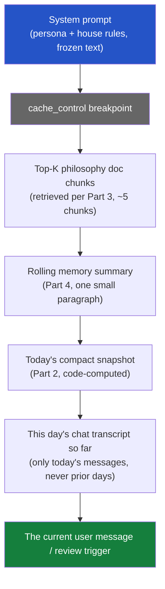

# Daily trade review chatbot — design (future work, not scheduled)

## What's wanted

A new feature, behind a feature flag: a button that triggers a "daily
review" — Claude looks at the user's current trades, the app's strategy/
screener data, and the user's own investment-philosophy document (a PDF
they already have, brought into the app once), and produces a summary
judgment. The user can then ask follow-up questions in a chat thread tied
to that day's review. Reviews and their chats persist day over day, so the
bot can reference "last Tuesday you were worried about X" — but the whole
thing has to stay cheap: context has to be actively managed, not just piled
up and resent every turn, or token cost grows unbounded with usage.

This doc has nothing to do with `backend/pdf_export.py` (the app's own
report-generation module, which writes PDFs, never reads them) — that's a
separate, unrelated piece of code. This is new territory: PDF ingestion,
a chat data model, and a context-assembly strategy, none of which exist in
the codebase today.

## Designed user-scoped from day one, real auth or not

Per `docs/superpowers/specs/2026-08-04-multi-user-trades-design.md`
(future work, also not scheduled), every table this feature introduces
carries `user_id INTEGER NOT NULL` from the start — same convention that
doc already settled on for `positions`/`push_subscriptions`/
`watchlist_tickers`. There is no real auth today, so every write and read
in this feature uses a single hardcoded constant instead of a resolved
session user:

```python
# backend/app.py or a shared constants module
DEFAULT_USER_ID = 1
```

Every insert/query in Parts 1 and 4 below includes `user_id`, populated
from `DEFAULT_USER_ID` everywhere a real app would use
`current_user.id`. This means:

- **Zero schema migration when real multi-user auth eventually lands** —
  the columns already exist, already `NOT NULL`, already indexed. The
  multi-user doc's own migration plan (backfill existing rows to a single
  default user) is *already satisfied* for this feature's tables, since
  they were born with `user_id = 1` rather than needing a retrofit.
- **Only the code that RESOLVES `user_id` changes later** — swap
  `DEFAULT_USER_ID` for whatever `Depends(get_current_user)` (or
  equivalent) resolves to, per endpoint. The queries, the schema, the
  retrieval logic, the rolling-summary logic — none of it changes shape.
- **Multiple people using the app today** (before real auth) would
  currently collide on `user_id = 1` — same limitation the whole app has
  today (one shared `positions` table), not something this feature makes
  worse. Not a regression to solve here.

This is the only cross-cutting change from the first draft — everything
else below is unchanged in shape, just with `user_id` added to each table
and each query.

## Answering the four questions directly

1. **Where does the initial PDF context live?** On disk (a persistent Docker
   volume, same pattern as `backend/app_data.db` today), parsed once into
   plain text, chunked, and the chunks stored in SQLite — never re-parsed
   from the raw PDF on every chat turn. See Part 1.
2. **How does the chatbot get current app data + memory of past patterns?**
   Current data is assembled fresh, cheaply, per request, from the DB's
   already-existing structured tables (positions, fills, strategy verdicts)
   — never sent as a raw dump, always as a compact computed summary. Past
   patterns come from a rolling **review-of-reviews** summary, updated
   incrementally, not from resending every prior day's full transcript. See
   Part 2 and Part 4.
3. **What's the similarity/retrieval strategy?** Embed the philosophy
   document's chunks once at ingest time; embed each day's review once at
   creation time; retrieve by cosine similarity against the current query
   at chat time, top-K only. See Part 3.
4. **What's the overall context-moderation strategy?** A layered budget —
   frozen system context (cached), a small retrieved slice of the
   philosophy doc, a compact current-state summary, a compact recent-memory
   summary, and only the current day's live chat turns in full. Nothing
   else is ever in the prompt. See Part 5.

## Part 1 — Storing the initial philosophy document

### Where the PDF itself lives

**On disk, not in the DB, not in git.** A new persistent volume, mounted
the same way `backend/app_data.db` already is in `docker-compose.yml`:

```yaml
volumes:
  - ./backend/app_data.db:/app/backend/app_data.db          # existing
  - ./backend/user_docs:/app/backend/user_docs                # new
```

The raw PDF is kept (not discarded after parsing) so it can be re-parsed
later if the extraction/chunking logic improves, without asking the user
to re-upload. It is never committed to git (add to `.gitignore`, same as
`app_data.db` already presumably is) and never sent to Claude as a raw
file on every request — see below for why.

### Why not just attach the PDF to every Claude request

The `document` content-block API (base64 PDF, or Files API `file_id`) is
the obvious first instinct, but it's wrong for a **recurring daily**
feature specifically because of the cost model:

- A PDF re-attached (even via `file_id`, which avoids re-uploading bytes
  but does NOT avoid re-processing them into context) costs input tokens
  **every single request** it's included in. A daily review, run for
  months, re-pays for the same static document hundreds of times.
- The philosophy document doesn't change day to day — it's exactly the
  kind of large, static content prompt caching exists for, but caching
  only helps within a TTL window (5min–1h); it does not help across a
  once-a-day trigger separated by many hours.
- Only a fraction of the document is usually relevant to any single day's
  review (e.g. today's review might only need the user's stated rules
  about position sizing and exit discipline, not their entire risk-
  tolerance essay or the parts about asset classes they don't currently
  hold).

The right pattern for "large static reference document, small relevant
slice needed per request, requests recur indefinitely" is **parse once,
embed once, retrieve the relevant slice per request** — RAG, not
re-attachment. This is also exactly why Part 3 (retrieval) exists.

### Parsing and chunking, once, at upload time

1. User uploads the PDF once via a new (feature-flagged) settings/upload
   endpoint.
2. Backend extracts text. `pypdf`/`pdfplumber` (new Python dependency —
   neither is in `requirements.txt` today) for a text-based PDF; if the
   document turns out to be scanned/image-based, the Claude API's own
   native PDF support (`document` content block, one-time call, NOT
   repeated per chat turn) can be used instead for this one-time
   extraction pass, trading a single moderate one-time cost for reliable
   text.
3. Chunk the extracted text — target ~500–800 tokens per chunk, with
   modest overlap (~50–100 tokens) so a concept split across a chunk
   boundary isn't lost entirely in either chunk. Simple paragraph/heading-
   aware chunking is enough here; this is a personal philosophy document,
   not a large corpus needing sophisticated semantic chunking.
4. Each chunk is embedded once (see Part 3) and stored.

### New DB tables

```sql
CREATE TABLE user_documents (
    id INTEGER PRIMARY KEY AUTOINCREMENT,
    user_id INTEGER NOT NULL,        -- DEFAULT_USER_ID today; real FK once auth lands
    filename TEXT NOT NULL,
    file_path TEXT NOT NULL,        -- path under the persistent volume
    uploaded_at TEXT NOT NULL,
    status TEXT NOT NULL             -- 'processing' | 'ready' | 'failed'
);
CREATE INDEX idx_user_documents_user ON user_documents(user_id);

CREATE TABLE document_chunks (
    id INTEGER PRIMARY KEY AUTOINCREMENT,
    user_id INTEGER NOT NULL,        -- denormalized from user_documents, avoids a join on every retrieval query
    document_id INTEGER NOT NULL REFERENCES user_documents(id),
    chunk_index INTEGER NOT NULL,    -- order within the document
    content TEXT NOT NULL,
    embedding BLOB NOT NULL,         -- see Part 3 for format
    created_at TEXT NOT NULL
);
CREATE INDEX idx_document_chunks_document ON document_chunks(document_id);
CREATE INDEX idx_document_chunks_user ON document_chunks(user_id);
```

Re-uploading a new version of the document (the user revises their
philosophy) creates a new `user_documents` row and new chunks — old chunks
stay (for the review history that referenced them) unless explicitly
pruned; the "active" document per user is whichever `status='ready'` row
is most recent for that `user_id`.

## Part 2 — Getting current app data into the review

This is the one part that's genuinely easy, because the data already
exists in exactly the structured form needed — no new fetch/compute
pipeline, just a read-and-summarize step.

### What "current app data" means, concretely

- **Real trades**: `db.list_positions("open")` + `db.list_fills(id)` per
  position — avg cost, units, TP/stop, realized/unrealized P&L (same
  numbers already shown on the Trades page).
- **Strategy/screener state**: for each ticker the user holds or
  watchlists, that ticker's current `verdict` per strategy (already
  computed and stored in `computed_results`, from the
  `strategy_state`-alert work done earlier this session) — no new
  computation, just a read.
- **Recent notifications**: today's `strategy_state`/`tp_progress` alerts
  already in the `notifications` table.

### Why this must be summarized, not dumped raw

A user with 15 open positions, each with several fills, plus 3 strategies'
worth of verdict/score data per ticker, is a genuinely large JSON blob if
sent verbatim. The fix is the same principle as Part 1: **compute a
compact summary server-side, in code, before it ever reaches Claude** —
not "send everything and let the model figure out what matters." A
Python function assembles a few-hundred-token structured summary (ticker,
side, days held, unrealized %, whether it's near TP/stop, current
strategy verdict) — Claude receives the *conclusion* of a database query,
not the database.

```python
def build_daily_snapshot(user_id: int = DEFAULT_USER_ID) -> dict:
    """Compact, code-computed summary of current trade state -- NOT raw
    DB dump. This is what actually goes in the prompt."""
    positions = db.list_positions("open", user_id=user_id)  # once positions carry user_id (multi-user doc); today just DEFAULT_USER_ID's rows
    return {
        "open_positions": [
            {
                "ticker": p["ticker"],
                "instrument": state["instrument"],
                "units": state["units_remaining"],
                "unrealized_pct": ...,       # already-existing calc, reused
                "days_held": ...,
                "near_tp_or_stop": ...,      # bool, from existing threshold logic
                "strategy_verdict": ...,     # current verdict per strategy, if any
            }
            for p in positions
        ],
        "realized_pnl_today": ...,
        "notable_alerts_today": [...],       # today's notifications, already compact
    }
```

This snapshot is regenerated fresh every time a review runs — it is
**not** persisted as its own artifact; only the review's own output text
is persisted (Part 4).

## Part 3 — Similarity/retrieval strategy

### Embeddings: which API, and why not Anthropic's

Anthropic does not currently offer a first-party embeddings endpoint —
the Claude API is for the chat/completion model itself. Two real options:

1. **Voyage AI** — Anthropic's recommended embeddings partner (referenced
   in Anthropic's own RAG guidance). A separate API call, separate small
   cost, but purpose-built and well-integrated with Claude workflows.
2. **A local/open embedding model** (e.g. `sentence-transformers`,
   ONNX-exported, run in-process) — zero additional API dependency or
   per-call cost, at the price of a larger Python dependency and needing
   to run the model locally in the container.

Given this app's small scale (one user, one document, one review a day),
**a local embedding model is the pragmatic choice** — avoids adding a
second paid API dependency for a workload this small, and embeddings only
need to be computed once per chunk (document ingest) plus once per day
(the day's review text) — not per chat message. `sentence-transformers`
with a small model (e.g. `all-MiniLM-L6-v2`, 384-dim, ~80MB) is more than
adequate for this scale and is a one-time, cheap local computation.

### Storage format

`document_chunks.embedding` and (Part 4) `daily_reviews.embedding` store
the vector as a raw `BLOB` — a packed array of 32-bit floats
(`numpy.ndarray.tobytes()` / `numpy.frombuffer()` to round-trip). No
vector-database dependency needed at this scale (a handful of document
chunks, one review per day) — a Python-side brute-force cosine similarity
over however many rows exist is fast enough that adding
pgvector/Pinecone/etc. would be solving a problem this app doesn't have.

```python
import numpy as np

def cosine_similarity(a: np.ndarray, b: np.ndarray) -> float:
    return float(np.dot(a, b) / (np.linalg.norm(a) * np.linalg.norm(b)))

def top_k_chunks(query_embedding: np.ndarray, user_id: int = DEFAULT_USER_ID, k: int = 5) -> list[dict]:
    rows = db.get_document_chunks(user_id=user_id)  # small table, fine to load fully -- filtered to this user's own document(s)
    scored = [
        (cosine_similarity(query_embedding, np.frombuffer(r["embedding"], dtype=np.float32)), r)
        for r in rows
    ]
    scored.sort(key=lambda x: x[0], reverse=True)
    return [r for _, r in scored[:k]]
```

### What gets embedded and searched, and when

| What | Embedded when | Searched when |
|---|---|---|
| Philosophy document chunks | Once, at upload | Every daily review trigger (top-K relevant chunks) |
| Each day's review text | Once, right after the review is generated | Every follow-up chat turn in later sessions (top-K most similar past reviews) |

The **query** used for retrieval is different at each point:
- **Daily review trigger**: query = the day's own compact snapshot (Part
  2) rendered as text — "what in my philosophy doc is relevant to today's
  actual positions/situation."
- **Follow-up chat message**: query = the user's literal message — "what
  in my philosophy doc, and what in past reviews, is relevant to what
  they're asking right now."

## Part 4 — Data model: reviews, chat, and memory

### New tables

```sql
CREATE TABLE daily_reviews (
    id INTEGER PRIMARY KEY AUTOINCREMENT,
    user_id INTEGER NOT NULL,           -- DEFAULT_USER_ID today
    review_date TEXT NOT NULL,          -- one review per user per calendar day
    summary_text TEXT NOT NULL,          -- Claude's generated review
    embedding BLOB NOT NULL,             -- for future similarity search
    snapshot_json TEXT NOT NULL,         -- the Part 2 snapshot, frozen at generation time
    created_at TEXT NOT NULL,
    UNIQUE (user_id, review_date)        -- was a bare UNIQUE on review_date -- must be per-user
);
CREATE INDEX idx_daily_reviews_user ON daily_reviews(user_id);

CREATE TABLE review_chat_messages (
    id INTEGER PRIMARY KEY AUTOINCREMENT,
    review_id INTEGER NOT NULL REFERENCES daily_reviews(id),
    role TEXT NOT NULL,                  -- 'user' | 'assistant'
    content TEXT NOT NULL,
    created_at TEXT NOT NULL
);
CREATE INDEX idx_review_chat_review ON review_chat_messages(review_id);
```

No direct `user_id` on `review_chat_messages` — reached via `review_id`,
same "inherit scoping through the parent" pattern the multi-user doc
already uses for `position_fills`/`trade_daily_marks` (no denormalized
column needed; a chat message never exists without its owning review).

Chat messages are scoped to one day's review — asking a follow-up on
Tuesday's review is a conversation about Tuesday's snapshot, not a single
endless thread. This bounds an individual conversation's natural length
(one trading day's worth of Q&A) without needing to invent an arbitrary
cutoff.

### The rolling memory summary (past patterns)

Storing every past review's full text and resending it all for "memory of
past patterns" is exactly the unbounded-growth trap the user flagged.
Instead: a **single rolling summary row**, updated incrementally, never
growing without bound:

```sql
CREATE TABLE review_memory_summary (
    user_id INTEGER PRIMARY KEY,              -- one row per user (was a hardcoded id=1 singleton -- that pattern breaks with >1 user); DEFAULT_USER_ID today
    summary_text TEXT NOT NULL,               -- "the user tends to exit too early on winners..."
    last_updated_review_id INTEGER NOT NULL REFERENCES daily_reviews(id),
    updated_at TEXT NOT NULL
);
```

After each day's review is generated, a **second, small, cheap Claude
call** (or the same call, one extra step) updates this summary: "here's
the existing rolling summary, here's today's new review — produce an
updated rolling summary, folding in anything durably pattern-worthy from
today, dropping anything that's now stale." This is the same idea as
context compaction (see `shared/agent-design.md` → Long-Running Agents:
Managing Context) applied at the *application data* layer instead of the
*conversation* layer — the rolling summary is itself a form of compaction,
done deliberately and reviewably rather than relying on the API's generic
compaction feature (which summarizes a conversation transcript, not a
structured history of daily judgments).

This keeps "memory of past patterns" at a small, roughly-constant token
cost forever, instead of `O(number of days used)`.

## Part 5 — The context-moderation strategy, end to end

### Per-request prompt assembly

Every request (daily review trigger, or a follow-up chat message) builds
its prompt from these layers, in this order (matches the render order
`tools → system → messages`, stable-content-first, per
`shared/prompt-caching.md`):



**What's cached vs. what's fresh every request:**

| Layer | Changes | Caching |
|---|---|---|
| System prompt | Never (until the feature itself is updated) | `cache_control` breakpoint here — cached across every request, all day, every day |
| Retrieved doc chunks | Per-request (different top-K depending on query) | Not cached — but small (~5 chunks × ~700 tokens ≈ 3-4K tokens), and retrieval itself is a local, free computation, not an API call |
| Rolling memory summary | Once per day (after each day's review) | Naturally small and stable within a day; not worth a separate breakpoint at this size |
| Today's snapshot | Fresh every request (positions can change during the day) | Never cached — must always be current |
| Today's chat so far | Grows through the day, resets each new day | Not cached across days (new day = new conversation); within a day, follows normal multi-turn caching if the day's chat gets long |

### Why this bounds cost regardless of how long the user uses the app

- **The philosophy document** is embedded once, ever (until re-uploaded).
  Retrieval cost is a local vector-math operation, not an API call — free
  in the Claude-cost sense, however many times it runs.
- **Past reviews** are never resent in full — only the rolling summary
  (Part 4), which is itself periodically re-compacted, so its size doesn't
  grow with the number of days the app has been used.
- **Today's snapshot** is always small (a handful of open positions,
  summarized) regardless of portfolio history length — it reflects
  *current* state, not history.
- **Chat transcripts** reset daily — a very active back-and-forth on one
  day doesn't inflate every future day's starting context.

The only quantity that's genuinely `O(usage)` is **storage** (more rows in
`daily_reviews`/`review_chat_messages` over time) — which is cheap and
fine — never **prompt tokens per request**, which is what actually costs
money and what the user is right to worry about.

### If a single day's chat itself gets long

Rare at this app's scale (a handful of follow-up questions per day, not a
sprawling multi-hour conversation), but if it happens: reuse the exact
compaction pattern from `SKILL.md` → Compaction (`compact-2026-01-12`
beta) on that one day's `review_chat_messages` thread specifically —
scoped to a single day's conversation, not attempted across days (which
the architecture above already prevents from ever needing to happen).

## Feature flag

Per `.env`'s existing (currently unused) `SHOW_*` boolean convention —
new var `ENABLE_DAILY_REVIEW` (default `false`), gating:
- The "Daily Review" button's visibility in the frontend.
- The backend endpoints that trigger a review / accept a follow-up
  message — return 404 or a clear "feature disabled" response when off,
  not just a hidden UI button (a determined user hitting the API directly
  shouldn't bypass the flag).

## New dependencies

```
pypdf                    # or pdfplumber -- PDF text extraction at upload time
sentence-transformers    # local embeddings, no external API dependency
anthropic                # Claude API client -- not currently a dependency at all
numpy                    # already a dependency (via pandas/backtesting) -- no new addition
```

## Open questions for whenever this is picked up

1. **Model choice for the review itself.** Per this skill's defaults,
   `claude-opus-5` unless there's a reason to go cheaper — a once-daily
   trigger plus a handful of follow-ups is low enough volume that Opus-
   tier quality is affordable regardless. Sonnet only if cost becomes a
   real concern at higher usage.
2. **Who triggers the daily review** — purely a manual button click (as
   asked), or should it also fire automatically once/day (e.g. tied to
   the market-hours background loop from the earlier design doc)? The
   request says "triggered by button," so manual-only is what's designed
   above; flagging in case an automatic daily trigger is also wanted
   later.
3. **PDF re-upload / versioning UX** — does the user want to see/manage
   multiple past versions of their philosophy doc, or just always
   overwrite with the latest?
4. **Rolling memory summary's own audit trail** — should old versions of
   `review_memory_summary` be kept (a lightweight version history, similar
   to how `memory_versions` work in Managed Agents) so the user can see
   how "what the bot thinks it knows about my patterns" evolved, or is
   the current single-row-overwritten version enough?
