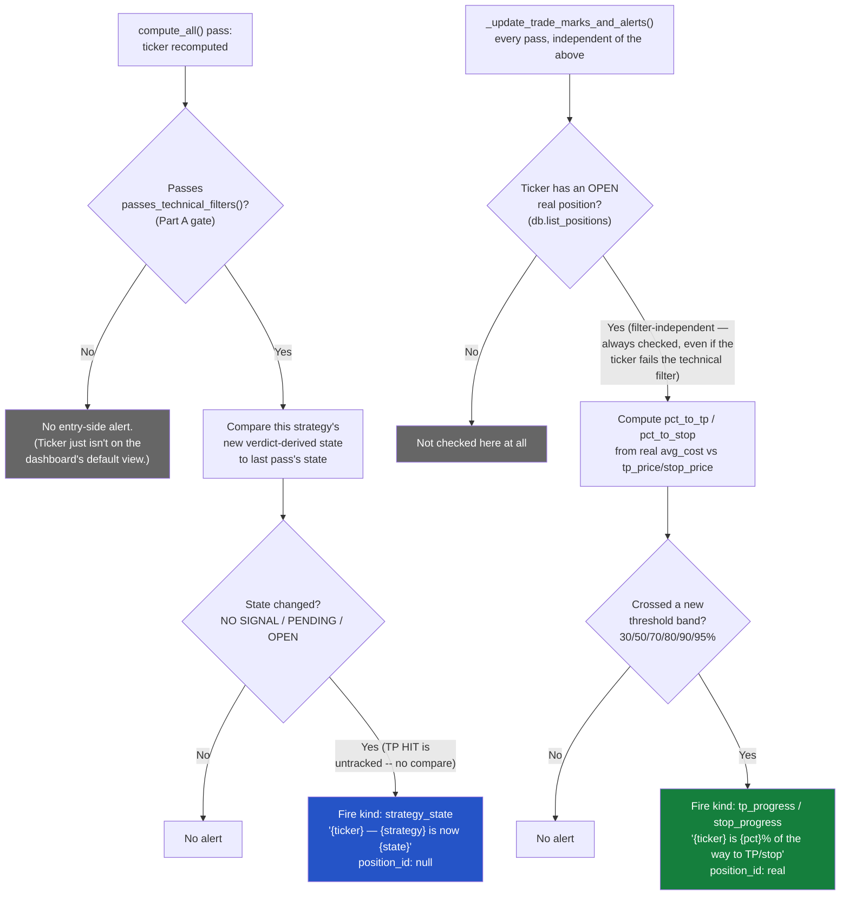

# Strategy state-change notification — design

## Revision 2: scoped down after real-world noise

Revision 1 (implemented, then reverted from "fire for everything") alerted
on every (ticker, strategy) state change across the full active universe —
~1400 tickers × 3 strategies. In practice this produced far too many
alerts to be useful. Scoped down per the user's correction:

- **OPEN / PENDING** (the entry side): only for tickers that pass the
  dashboard's own default technical filter — i.e. the same universe already
  shown on the dashboard, not the full unfiltered active-ticker set.
- **TP / exit** (the closing side): only for the user's own real,
  confirmed trades (the `positions` table) — **this already exists** and
  needs no new work; see below.

## Flow



Part A (top) and Part B (bottom) run independently, once per `compute_all()`
pass, and never gate each other — a ticker can fire both, one, or neither
in the same pass depending on whether it passes the technical filter
(Part A only) and whether it has a real open position (Part B only).

## Part A — OPEN/PENDING, filtered to the default-filter universe

### What "default filter" means

`backend/build_universe.py::passes_technical_filters(df)` — already the
exact gate `compute_all()` uses to decide `filtered_tickers`, i.e. the
tickers actually shown on the dashboard today:

```python
def passes_technical_filters(df: pd.DataFrame) -> bool:
    return matches_vexh_setup(df) or matches_vcp_setup(df) or matches_vcpo_setup(df)
```

This is a ticker-level pass/fail (true if it matches ANY strategy's entry
setup), already computed once per pass inside `compute_all()`
(`backend/app.py`, the `filtered_tickers` loop, ~line 239-251) — no new
computation needed, just gating the alert on a value already sitting in
scope at the exact point the state comparison happens.

### Revised rule

Fire a `PENDING`/`OPEN` state-change alert for (ticker, strategy) only if
that ticker is in `filtered_tickers` this pass (i.e. passed
`passes_technical_filters()`) — same population already visible on the
dashboard, nothing hidden/filtered-out ever alerts. A ticker that's only in
`_active_tickers()` because it's watchlisted or has an open position, but
currently fails the technical filter, does NOT get entry-side alerts (it
may still get real-trade TP/exit alerts via Part B if it has an open
position — that's a separate, unrelated gate).

`TP`/`NO SIGNAL` transitions (the exit side of a strategy's own simulated
signal, NOT a real trade) are dropped entirely per the scoping below — Part
B already covers the real, user-facing version of "this closed."

### Detecting the change (updated)

```python
# filtered_tickers already computed earlier in compute_all() -- the set of
# tickers that pass the dashboard's own default technical filter this pass.
filtered_set = set(filtered_tickers)

# inside the per-ticker recompute loop, once the new payload is built:
if tk in filtered_set:
    for strat_key in _STRATEGY_MODULES:
        prior_state = _strategy_entry_state((prior_by_ticker.get(tk) or {}).get(strat_key))
        new_state = _strategy_entry_state(payload.get(strat_key))
        if prior_state is not None and new_state is not None and new_state != prior_state:
            _fire_strategy_state_alert(tk, strat_key, new_state, now_iso)
```

`_strategy_entry_state()` replaces the old 4-branch `_strategy_state()` —
now only 3 branches, TP HIT is no longer a state this alert tracks:

| `state` | Condition |
|---|---|
| `NO SIGNAL` | `verdict == "NO SIGNAL"` |
| `PENDING` | `verdict in ("TAKE", "SKIP")` |
| `OPEN` | `verdict == "IN TRADE"` |

`verdict == "TP HIT"` maps to `None` (untracked) rather than a 4th state —
so a transition INTO or OUT OF `TP HIT` is invisible to this function
entirely; it's simply not compared. (A ticker sitting at `IN TRADE` that
becomes `TP HIT` produces `new_state = None`, which the `is not None` guard
already skips — no accidental alert, no accidental gap in the OPEN state
either, since OPEN→TP HIT→open-position-still-truthy is naturally silent,
matching "we don't alert on the strategy's own TP, only a real trade's.")

## Part B — TP/exit, already implemented via real trades

Confirmed: `_update_trade_marks_and_alerts()` (`backend/app.py`) already
does exactly this, and has since before this whole notification thread
started:

- Iterates `db.list_positions("open")` — only the user's own real,
  confirmed Trades-tab positions, never the full ticker universe.
- **No technical-filter dependency at all** — `price_by_ticker` is sourced
  from `_computed` (every successfully-computed ticker), not
  `filtered_tickers`. A real trade that's lost momentum and no longer
  passes `passes_technical_filters()` still gets checked every pass; this
  was the exact guarantee fixed and verified earlier this session (the
  CBRS "insufficient history shouldn't stop the trade" thread) — Part A's
  new filter gate must never be applied here. TP/exit fires regardless of
  whether the ticker is currently "on the dashboard" or not.
- `_fire_threshold_alerts()` fires progress notifications
  (`tp_progress`/`stop_progress`, `TP_STOP_ALERT_THRESHOLDS = [30, 50, 70,
  80, 90, 95]`) as a real position's price approaches TP or stop.
- This is a different notion of "TP" than Part A's strategy-level `TP HIT`
  verdict — Part B is the REAL position's actual price progress toward the
  REAL tp_price/stop_price the user set, not the strategy's own backtested
  simulation.

**No new work needed for this half.** It already exists, already correctly
scoped to real trades only. This doc's earlier "TP/NO SIGNAL (exit)" states
for the strategy-signal side are dropped from Part A's tracked states
(see table above) specifically because Part B already owns "did a real
trade hit TP/exit" — tracking it twice (once per fake strategy signal, once
per real position) is the redundancy being removed here.

## What changes vs. the original implementation

- `_strategy_state()` → `_strategy_entry_state()`, drops the `TP HIT` →
  `"TP"` branch (now maps to `None`, untracked).
- The alert-fire call gets one new guard: `if tk in filtered_set` (or
  equivalent — could also be expressed as re-deriving
  `passes_technical_filters()` per ticker at the fire point, but reusing
  the already-computed `filtered_tickers` set from earlier in the same
  `compute_all()` pass is free and avoids a second technical-filter
  evaluation).
- Message wording: no `TP` case left to word — `"{ticker} — {strategy} is
  now {state}"` still applies to the remaining 3 states.
- Everything else (nullable `position_id`/`pct` migration, `kind:
  "strategy_state"`, delivery mechanism, silent-on-cold-start rule) is
  unchanged from the original implementation and doesn't need to be
  reverted or redone — only the state set and the filter gate change.

## Open questions for the user

1. Confirmed noise fix is "filtered_tickers only" for entry-side alerts —
   is that filtered-down volume expected to be low enough now, or does the
   user want to watch it live for a day before deciding if watchlist-only
   is still needed on top of this?
2. Since `TP HIT` is now untracked by Part A, is there any remaining
   interest in a strategy-level (not real-trade) "this simulated signal
   fully closed" alert at all, or is dropping it entirely (relying only on
   Part B for real trades) the whole intent?
