# Screening/Fetch Unification — Refactor Doc

Status: **design only, not implemented**. This documents the plan agreed in
conversation before any code changes.

## The problem

Universe screening (`build_universe.screen_technicals`) and price fetching
(`data.warm_cache`) both download the same OHLCV history from Yahoo, as two
separate, uncoordinated passes:

- **Screening** (`rebuild_universe()` → `screen_technicals()`): batches
  candidates into chunks of 100, calls `yf.download(chunk, period="2y",
  group_by="ticker", threads=True)` once per chunk, runs
  `passes_technical_filters(df)` against the in-memory result, keeps only the
  passing **symbols**, and discards the DataFrame entirely. Nothing is
  persisted.
- **Fetching** (`refresh_and_compute()` → `data.warm_cache()` →
  `_fetch_one()`): for every ticker in `_active_tickers()` (the *previous*
  screening pass's survivors + watchlisted tickers), calls
  `yf.download(ticker, start=..., ...)` **one ticker at a time**, and
  persists the result via `db.upsert_bars()`.

For any ticker that's **new** to the universe this cycle (passed screening
for the first time), fetching then re-downloads the same ~2-year window
screening just pulled seconds earlier and threw away — a real, wasted
duplicate call to Yahoo.

### Current flow (as of this doc)

```mermaid
flowchart TD
    trigger["Cold start / hard refresh / 2h background wake"] --> ru["rebuild_universe()"]

    ru --> fc["fetch_candidates()\nYahoo screener API, symbols only"]
    fc --> st["screen_technicals()"]

    subgraph screen ["Screening — discarded after use"]
        st --> chunk["yf.download(chunk of 100, period=2y)"]
        chunk --> filt["passes_technical_filters(df)\nper ticker"]
        filt -->|discard DataFrame| passed["passed: list[symbol]"]
    end

    passed --> wtf["write_tickers_file()\nnew TICKERS list"]
    wtf --> rac["refresh_and_compute()"]

    rac --> wc["data.warm_cache(_active_tickers())"]
    subgraph fetch ["Fetching — persisted, ONE TICKER AT A TIME"]
        wc --> fo["_fetch_one(ticker)\nyf.download per symbol"]
        fo -->|"new ticker: full 2y re-download\n(DUPLICATE of screening's pull)"| up["db.upsert_bars()"]
        fo -->|"known ticker: incremental gap only"| up
    end

    up --> ca["compute_all()"]
    ca --> done(["dashboard payloads ready"])

    style screen fill:#3a1f1f,stroke:#b3261e
    style fetch fill:#1f2a3a,stroke:#2554c7
```



## What we measured

Local, rate-limit-affected but apples-to-apples, 200 tickers:

| Approach | Requests | Time | Effective rate |
|---|---|---|---|
| Batch (`screen_technicals`, 2× 100-chunks, sequential) | 2 | 31.35s | ~6.4 tickers/s |
| Per-ticker parallel (`_fetch_one`, 30 workers) | 200 | 31.58s | ~6.3 tickers/s |

**Wall-clock throughput is a wash.** Batching wins on *request count* (2 vs.
200 HTTP calls to Yahoo for the same data), which likely matters more for
rate-limit exposure than for raw speed — but since throughput itself doesn't
suffer, the plan below ships the simpler per-ticker version first (see
**Now** below) and defers batching to a **Future feature**.

We also confirmed the technical filter rarely rejects anything: a live
`/api/meta` snapshot showed `screen_progress.total` (raw candidates) at 2156
vs. `total_tickers` (previous survivors) at 2094 — most candidates pass.
This is why the filter doesn't need its own dedicated network round-trip; it
can run as a cheap in-memory pass over data that's already been fetched for
other reasons.

## The agreed design

**One download pass, ever, per ticker, per cycle** — shared by all three
trigger paths (first-time cold start, hard/manual refresh, and the 2-hour
background wake), because they are already, today, "doing the exact same
thing" through `warm_cache()`. Screening should reuse that same mechanism
instead of running its own separate download.

### Now: one download per ticker, real `start=`, no chunking

Ship this first — it already removes the duplicate download entirely, with
no new chunking/bucketing logic to build.

1. **`fetch_candidates()`, called once per cycle, result persisted.** Yahoo
   screener API (metadata query, no bars) — called once, from
   `refresh_and_compute()`, and its result immediately written to a new
   `candidate_tickers` DB table (see Decisions below) so nothing else in the
   cycle needs to call it again.
2. **Fetch the candidate list through the existing per-ticker path.**
   `data.warm_cache()` (and `_fetch_one()` underneath it) already computes
   each ticker's real `start=` — `HISTORY_START` if never seen,
   `last_bar_date + 1 day` if already stored — and persists via
   `db.upsert_bars()`. Point this at `_active_tickers()` (now reading the
   candidate table, not `TICKERS`), instead of running a separate screening
   download. No changes needed to `_fetch_one()`/`upsert_bars()` themselves.
3. **No separate filter step, no `write_tickers_file()` gate.**
   `compute_all()` becomes the single place that both decides universe
   membership and computes strategy results:
   - Pull each candidate's bars straight from the DB.
   - Run `passes_technical_filters()` against them (no network call — the
     data's already there from step 2).
   - If it passes, run the normal per-strategy computation on the same
     bars and produce its dashboard payload.
   - If it doesn't pass, skip it — no payload, not part of this cycle's
     dashboard output.
   `webapp/tickers.py` / `TICKERS` as a persisted, file-backed gate between
   screening and computing is removed entirely (see Decisions below);
   membership is decided fresh, in memory, every time `compute_all()` runs.

```mermaid
flowchart TD
    trigger["Cold start / hard refresh / 2h background wake"] --> fc["fetch_candidates()\nYahoo screener API, symbols only\ncalled ONCE per cycle"]
    fc --> sc["db.set_candidate_tickers()\npersist for this cycle's other reads"]

    sc --> at["_active_tickers()\nreads candidate_tickers + watchlist_tickers"]
    at --> wc["data.warm_cache(_active_tickers())\nexisting per-ticker path, unchanged"]
    subgraph fetch ["Fetch — ONE download per ticker, ever, real start="]
        wc --> fo["_fetch_one(ticker)\nyf.download per symbol, real start="]
        fo --> up["db.upsert_bars()\nunchanged"]
    end

    up --> ca["compute_all()\nalso reads _active_tickers()"]
    subgraph compute ["compute_all() — membership + computation, unified"]
        ca --> pull["pull each candidate's bars from DB"]
        pull --> filt["passes_technical_filters()\nno network call"]
        filt -->|pass| strat["run strategies, build payload"]
        filt -->|fail| skip["skip -- no payload this cycle"]
    end

    strat --> done(["dashboard payloads ready"])

    style fetch fill:#1f2a3a,stroke:#2554c7
    style compute fill:#1f3a24,stroke:#157f3d
```



### Why this covers first-time / hard-refresh / background identically

All three already funnel through `refresh_and_compute()` →
`data.warm_cache()` today for the *fetch* half of the pipeline (`force`
just changes whether `_fetch_one` does a full cold pull or an incremental
gap). Pointing that same call at the candidate list means there is exactly
one fetch implementation for all three triggers, not two
(batch-for-screening, per-ticker-for-everything-else). Downstream,
`compute_all()` is likewise already the one shared compute path for all
three triggers; this plan just gives it the extra job of membership
filtering it didn't have before.

## Future feature: chunked/batched fetch (deferred)

Not part of the near-term plan — recorded here so the idea isn't lost.
Per-ticker requests to Yahoo (~2156 individual calls) work fine at measured
throughput, but batching would cut request *count* substantially if
rate-limit pressure ever becomes a problem:

1. **Group tickers by shared `start=`.** Bucket the candidate list by
   `db.get_last_bar_date()` result (or "never fetched") so every ticker in
   a bucket wants the same `start=` date — this is what makes a single
   `yf.download(chunk, start=X, ...)` call valid for the whole chunk without
   forcing anyone to re-fetch further back than they need.
2. **Within each `start=` bucket, sub-chunk by 50.** Batch size within a
   bucket caps at 50 tickers per `yf.download()` call (smaller than
   screening's current 100 — a deliberate, more conservative starting
   point for the batched path, tunable once real request/latency data
   exists for it).
3. **Batch persistence.** A new `db.upsert_bars_many()` alongside the
   existing per-ticker `upsert_bars()` — `sqlite3.executemany()` doesn't
   care whether row tuples come from one ticker or fifty, so this is a
   straightforward extension: flatten every ticker's `(ticker, date, open,
   high, low, close, volume)` rows from the whole chunk into one list and
   `executemany()` them in a single transaction, then do the same for the
   `fetch_meta` upserts. One DB round-trip per chunk instead of one per
   ticker.

This is intentionally the same fetch call site as the "Now" plan above — a
future swap of `data.warm_cache()`'s internals from per-ticker to
grouped-and-batched, without changing anything about how `rebuild_universe()`
or `compute_all()` call it.

## Decisions

1. **Wasted-candidate bars: accepted, not a problem.** The ~3% of
   candidates that fail the filter get bars persisted too, sitting unused
   until next cycle. Cheap (daily bars, small fraction of the universe) —
   a better tradeoff than keeping the redundant download layer just to
   avoid it.
2. **`webapp/tickers.py` (the file) is removed; candidates move to a DB
   table instead of a source file.** It no longer gates anything once
   `compute_all()` decides membership fresh each cycle, so there's no
   reason to keep it as an importable `.py` module (which also needs
   `importlib.reload()` to pick up changes within the same process — extra
   ceremony for what's really just cache data). `write_tickers_file()` and
   the `TICKERS` module-level list go away, replaced by a `candidate_tickers`
   table in `db.py`, following the exact same pattern already used for
   `watchlist_tickers` (`set_watchlist_tickers()`/`get_watchlist_tickers()`
   in `webapp/db.py`) — one `DELETE` + bulk `INSERT` on write, a plain
   `SELECT` on read, no file I/O, no reload.
3. **Progress reporting: two phases, "fetching" then "computing."**
   `screen_progress` goes away entirely (screening no longer has its own
   download step to report on). The bar becomes 2-phase: **fetching**
   (`data.warm_cache()` pulling candidate bars) → **computing**
   (`compute_all()`'s membership filter + strategy computation, still one
   combined phase since the filter is now a cheap in-memory step inside it,
   not worth a separate progress signal). Frontend label text updates from
   the current 3-phase "screening → fetching → computing" to just
   "fetching → computing."

### Follow-on: `_active_tickers()` needs a new source, without double-calling Yahoo

`_active_tickers()` has two call sites per cycle (`refresh_and_compute()`
and `compute_all()`). Naively having it call `fetch_candidates()` directly
would hit Yahoo's screener API twice per cycle for what should be the same
list — a real, avoidable network call, not just a style concern.

Fix: `fetch_candidates()` runs **once** per cycle, in `refresh_and_compute()`
(the outer, once-per-cycle entry point), and its result is persisted to the
new `candidate_tickers` DB table immediately. `_active_tickers()` then just
reads that table — cheap, in-process, no network call — unioned with
watchlisted tickers, same as it unions with `TICKERS` today:

```python
# webapp/db.py
def set_candidate_tickers(tickers: list[str], fetched_at: float) -> None:
    with _lock, _conn:
        _conn.execute("DELETE FROM candidate_tickers")
        _conn.executemany("INSERT INTO candidate_tickers (ticker, fetched_at) VALUES (?, ?)",
                           [(tk, fetched_at) for tk in tickers])

def get_candidate_tickers() -> list[str]:
    with _lock:
        rows = _conn.execute("SELECT ticker FROM candidate_tickers").fetchall()
    return [r[0] for r in rows]
```

```python
# webapp/app.py
def refresh_and_compute(force: bool = False) -> None:
    ...
    candidates = build_universe.fetch_candidates()   # once per cycle
    db.set_candidate_tickers(candidates, time.time())
    data.warm_cache(_active_tickers(), force=force)   # reads the table, no re-fetch
    ...
    compute_all(force=force)                          # also reads the table via _active_tickers()

def _active_tickers() -> list[str]:
    candidates = db.get_candidate_tickers()  # from the DB table, NOT a live Yahoo call
    watchlisted = db.get_watchlist_tickers()
    seen = set(candidates)
    return candidates + [tk for tk in watchlisted if tk not in seen]
```

Between cycles (e.g. a page load hitting `_active_tickers()` indirectly
through some other path, if one ever exists), this returns whatever the
*last* completed cycle's candidate fetch found — same staleness
characteristic `TICKERS` already had as a file, just stored differently.

## Non-goals

- No change to `CHECK_INTERVAL` / `UNIVERSE_REFRESH_INTERVAL` cadence.
- No parallelization of per-ticker fetches beyond what `data.py`'s existing
  `_fetch_executor` already does — no new chunking/batching logic in the
  "Now" plan (see Future feature above for where that goes later).
