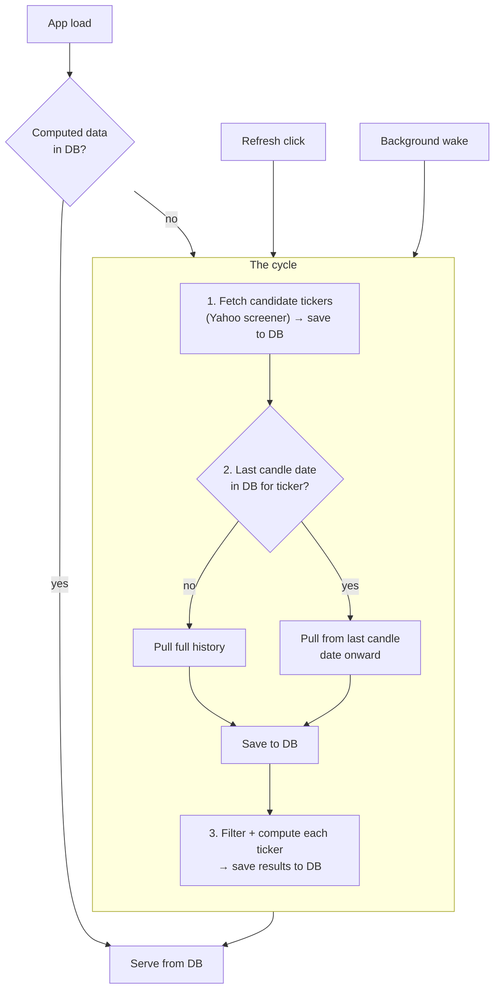

# Screening/Fetch Unification

Status: design, not implemented.

## The cycle

1. Fetch candidate tickers (Yahoo screener) → save to DB.
2. Pull each ticker's price data → save to DB.
   Before pulling, check the DB for that ticker's last candle date.
   No existing data → pull full history. Data exists → pull only from the
   last candle date onward (incremental).
3. Filter + compute each ticker → save results to DB.

One cycle, one download per ticker, everything persisted as it goes.

## When it runs

- **App load / refresh (browser):** if computed data already exists in the
  DB, just serve it — no fetch, no compute.
- **No computed data exists:** run the cycle.
- **User clicks Refresh:** run the cycle.
- **Background loop (every `CHECK_INTERVAL`):** run the cycle.

## What goes away

- `webapp/tickers.py` (the file). Candidates live in a DB table instead.
- The separate screening download (`screen_technicals()`'s own
  `yf.download(chunk, period="2y")`). Screening becomes: get candidate
  symbols, then reuse the normal per-ticker fetch for their bars.

## Cold start

Empty DB (fresh deploy, wiped DB) — nothing exists yet for the app to
serve, so the first load waits until the cycle finishes.

## To do before writing code

- `_active_tickers()` / candidate table: make sure nothing double-fetches
  or double-calls Yaho screener in one cycle.
- `compute_all()`'s existing "reuse if bars unchanged" logic needs to still
  run the pass/fail filter, not skip it for reused tickers.
